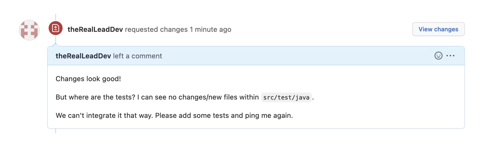
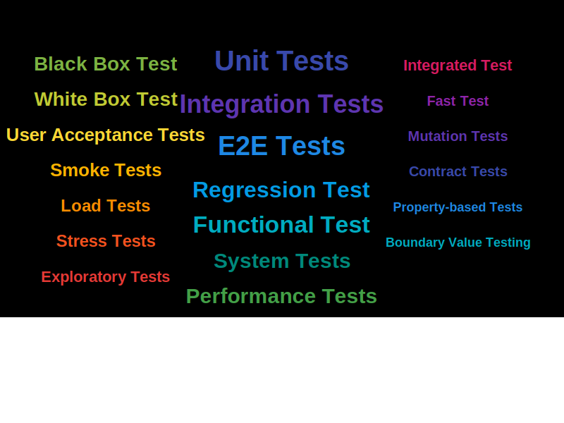
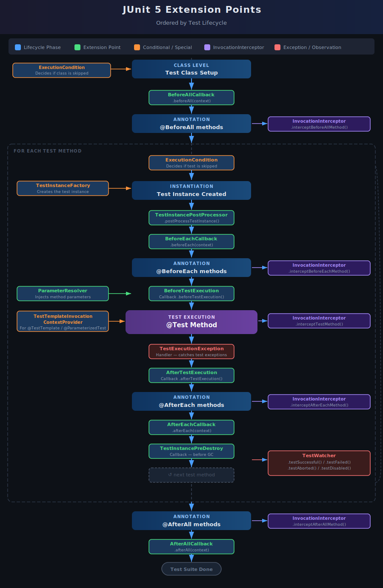

---

<!--

Question: Who is writing tests manually and who is enjoying it?

--> 


# Testing Spring Boot Applications Demystified

## First Workshop Day

_Digdir Workshop 02.03.2026_

Philip Riecks - [PragmaTech GmbH](https://pragmatech.digital/) - [@rieckpil](https://x.com/rieckpil)


--- 

<!--

- Welcome, Introduction
- Overview of the workshop  
- When to eat, toilet, WLAN

-->

<!-- header: 'Testing Spring Boot Applications Demystified Workshop @ Digdir 02.03.2026' -->
<!-- footer: '' -->

# Organization

- Hotel WiFi: `TBD` Password: `TBD`
- Slides & Code will be shared
- Sharing links during the workshop: 
- Please interrupt me any time if you have questions or want to share your experience
- Workshop lab requirements
  - Java 21
  - Docker Engine configured to run with Testcontainers
  - GitHub Account (preferably a personal) as a fallback to work with GitHub Codespaces

---


---

### Planned Timeline for the First Workshop Day

- 9:00 - 10:30: **Testing Basics and Unit Testing with Spring Boot** 
- 10:30 - 11:00: **Coffee Break & Time for Exercises** 
- 11:00 - 12:30: **Sliced Testing - Introduction and Verifying the Web Layer**
- 12:30 - 13:30: **Lunch** 
- 13:30 - 15:00: **Sliced Testing Continued, including Testing the Persistence Layer**
- 15:00 - 15:30: **Coffee Break & Time for Exercises**
- 15:30 - 17:00: **Integration Testing - Introduction and Strategies to Start the Entire Context**

Each 90-minute lab session will include a mix of explanations, demonstrations, and hands-on exercises. 

---


# Goals of this Workshop

- **Demystify** the complexities of testing Spring Boot applications
- Provide clear explanations, practical insights, and **actionable** **best** **practices**
- Become **more** **productive** and **confident** in your development and testing efforts
- Help reduce build times and keep it as a reasonable time to allow **fast** **feedback**
- Share testing & build setup tips & tricks

---


## Workshop Instructor: Philip

- Self-employed IT consultant from Herzogenaurach, Germany (Bavaria) 🍻
- Blogging & content creation for more than five years with a focus on testing Java and specifically Spring Boot applications 🍃
- Founder of PragmaTech GmbH - Enabling Developers to Frequently Deliver Software with More Confidence 🚤
- Enjoys writing tests 🧪
- @rieckpil on various platforms

---

## Getting to Know Each Other

- What's your name?
- What's your role in your team?
- How is automated testing handled in your team? 
- Do you have any specific testing challenges? 
- What's your expectation for this workshop?

---


# Lab 1

## Testing Basics and Unit Testing with Spring Boot

---
<!-- paginate: true -->

<!-- header: '' -->
<!-- footer: '' -->
<!--


Notes:

- Raise hands if you enjoy writing tests -> I do and hope I can change that for some of you today
- Why do we Test Code?
- Why is testing an afterthought?
- How to make testing more joyful?


-->


# Getting Started with Testing

## My Personal Journey as a Junior Developer

---

<!-- header: 'Testing Spring Boot Applications Demystified Workshop @ Digdir 02.03.2026' -->
<!-- footer: '' -->

<!--
- My story towards testing
- What I mean with testing: automated tests written by a developer
- Shifting left
- How much confidence do I have to deploy on a friday afternoon to prod on a dependabot update?
- Don't work towards 100% code coverage
- Fast feedback loops
- Quicker development, errors pop up more early, wouldn't say bugs, but sometimes we are overconfident only to realize after the deployment we missed a parameter or misspelled it. Avoid friction


-->

### Getting Used To Testing At Work



---


# Why Test Software?

---


## Automated Testing in the AI Era

- AI generates the code; you own the consequences.
- Co-pilots don’t carry pagers. You do.
- The faster the code is generated, the faster you need to prove it’s correct.
- AI is the accelerator; your test suite is the brakes. You can't drive fast without both.
- Mass-produced code without (the correct) mass-produced tests is just technical debt at scale.

---


### Common Testing Misconceptions

- Testing is only for finding bugs
- Testing is time-consuming and slows down development
- Testing is only for QA teams
- Testing is not necessary if the code looks simple
- Testing only until we increase code coverage to goal X%
- Testing is a neglected afterthought

... testing Spring Boot applications is complicated.

---

## Spring Boot Testing - The Bad & Ugly


---


## Spring Boot Testing - The Good


---


## How Much Testing is _Enough_?

---

<!-- footer: '' -->


### My Overall Northstar for Automated Testing

Imagine seeing this pull request on a Friday afternoon:


How confident are you to merge this major Spring Boot upgrade and deploy it to production once the pipeline turns green?

Good tests don't just catch bugs - they give you **fast feedback** and **confident deployments**.

---

### Naming Things Is Hard



---

### My Pragmatic Test Name Approach

1. **Unit Tests**: Tests that verify the functionality of a single, isolated component (like a method or class) by mocking or stubbing all external dependencies.
2. **Integration Tests**: Tests that verify interactions between two or more components work correctly together, with real implementations replacing some mocks.
3. **E2E**: Tests that validate the entire application workflow from start to finish, simulating real user scenarios across all components and external dependencies.

---

## Maven Build Lifecycle


- **Maven Surfire Plugin** for unit tests: default postfix  `*Test` (e.g. `CustomerTest`)
- **Maven Failsafe Plugin** for integration tests: default postfix `*IT` (e.g. `CheckoutIT`)
- Reason for splitting: different **parallelization** options, better **organisation**

---

## Maven Coordinates

```xml
<plugin>
  <groupId>org.apache.maven.plugins</groupId>
  <artifactId>maven-surefire-plugin</artifactId>
</plugin>
<plugin>
  <groupId>org.apache.maven.plugins</groupId>
  <artifactId>maven-failsafe-plugin</artifactId>
  <executions>
    <execution>
      <goals>
        <goal>integration-test</goal>
        <goal>verify</goal>
      </goals>
    </execution>
  </executions>
</plugin>
```

---

<!-- _class: section -->

# Spring Boot Testing Basics
## Spring Boot Starter Test, Build Tools, Conventions, Unit Testing

---


### Our foundation: Spring Boot Starter Test


- The "Testing Swiss Army Knife"


```xml
<dependency>
  <groupId>org.springframework.boot</groupId>
  <artifactId>spring-boot-starter-test</artifactId>
  <scope>test</scope>
</dependency>
```

- Batteries-included for testing by transitively including popular testing libraries
- Out-of-the-box dependency management to ensure compatibility

---

<!--
Notes:
- Go to IDE to show the start
- Navigate to the parent pom to see the management
- Show the sample test to have seen the libraries at least once

Tips:
- Favor JUnit 5 over JUnit 4
- Pick one assertion library or at least not mix it within the same test class
-->

```shell {4-6,13,15-16,17,25,29}
./mvnw dependency:tree
[INFO] ...
[INFO] +- org.springframework.boot:spring-boot-starter-test:jar:4.0.2:test
[INFO] |  +- org.springframework.boot:spring-boot-test:jar:4.0.2:test
[INFO] |  +- org.springframework.boot:spring-boot-test-autoconfigure:jar:4.0.2:test
[INFO] |  +- com.jayway.jsonpath:json-path:jar:2.10.0:test
[INFO] |  |  \- org.slf4j:slf4j-api:jar:2.0.17:compile
[INFO] |  +- jakarta.xml.bind:jakarta.xml.bind-api:jar:4.0.4:test
[INFO] |  |  \- jakarta.activation:jakarta.activation-api:jar:2.1.4:test
[INFO] |  +- net.minidev:json-smart:jar:2.6.0:test
[INFO] |  |  \- net.minidev:accessors-smart:jar:2.6.0:test
[INFO] |  |     \- org.ow2.asm:asm:jar:9.7.1:test
[INFO] |  +- org.assertj:assertj-core:jar:3.27.6:test
[INFO] |  |  \- net.bytebuddy:byte-buddy:jar:1.17.8:test
[INFO] |  +- org.awaitility:awaitility:jar:4.3.0:test
[INFO] |  +- org.hamcrest:hamcrest:jar:3.0:test
[INFO] |  +- org.junit.jupiter:junit-jupiter:jar:6.0.2:test
[INFO] |  |  +- org.junit.jupiter:junit-jupiter-api:jar:6.0.2:test
[INFO] |  |  |  +- org.opentest4j:opentest4j:jar:1.3.0:test
[INFO] |  |  |  +- org.junit.platform:junit-platform-commons:jar:6.0.2:test
[INFO] |  |  |  \- org.apiguardian:apiguardian-api:jar:1.1.2:test
[INFO] |  |  +- org.junit.jupiter:junit-jupiter-params:jar:6.0.2:test
[INFO] |  |  \- org.junit.jupiter:junit-jupiter-engine:jar:6.0.2:test
[INFO] |  |     \- org.junit.platform:junit-platform-engine:jar:6.0.2:test
[INFO] |  +- org.mockito:mockito-core:jar:5.5.0:test
[INFO] |  |  +- net.bytebuddy:byte-buddy-agent:jar:1.17.8:test
[INFO] |  |  \- org.objenesis:objenesis:jar:3.3:test
[INFO] |  +- org.mockito:mockito-junit-jupiter:jar:5.5.0:test
[INFO] |  +- org.skyscreamer:jsonassert:jar:1.5.3:test
[INFO] |  |  \- com.vaadin.external.google:android-json:jar:0.0.20131108.vaadin1:test
[INFO] |  +- org.springframework:spring-core:jar:7.0.3:compile
[INFO] |  |  +- commons-logging:commons-logging:jar:1.3.5:compile
[INFO] |  |  \- org.jspecify:jspecify:jar:1.0.0:compile
[INFO] |  +- org.springframework:spring-test:jar:7.0.3:test
[INFO] |  \- org.xmlunit:xmlunit-core:jar:2.10.4:test
```

---

## Transitive Test Dependency #0: JUnit 6

- Modern testing framework for Java applications
- Spring Boot >= 4.0 uses JUnit 6 by default
- JUnit 5 is a rewrite of JUnit 4
- JUnit 5 = JUnit Jupiter + JUnit Vintage + JUnit Platform
- Key features: parameterized tests, nested tests, extensions, parallelization

```java
@Test
void shouldCreateNewBook() {
  Book book = new Book("1234", "Spring Boot Testing", "Test Author");

  assertEquals("1234", book.getIsbn());
}

```

---

## Transitive Test Dependency #1: Mockito

- Mocking framework for unit tests
- Used to isolate the class under test from its dependencies
- Allows verification of interactions between objects
- Golden Mockito Rules:
  - Don't mock what you don't own
  - Don't mock value objects
  - Don't mock everything
  - Show some love with your tests

---


```java
@ExtendWith(MockitoExtension.class)
class BookServiceTest {
  
  @Mock
  private BookRepository bookRepository;
  
  @InjectMocks
  private BookService bookService;
  
  @Test
  void shouldReturnBookWhenFound() {
    when(bookRepository.findByIsbn("1234")).thenReturn(Optional.of(expectedBook));
    
    Optional<Book> result = bookService.getBookByIsbn("1234");
    
    verify(bookRepository).findByIsbn("1234");
  }
}
```

---


## Transitive Test Dependency #2: AssertJ

- Fluent assertion library for Java tests
- Provides more readable, chain-based assertions
- Rich set of assertions for collections, exceptions, and more

```java
@Test
void shouldProvideFluentAssertions() {
  List<Book> books = List.of(
    new Book("1234", "Spring Boot Testing", "Test Author"),
    new Book("5678", "Advanced Spring", "Another Author")
  );
  
  assertThat(books)
    .hasSize(2)
    .extracting(Book::getTitle)
    .containsExactly("Spring Boot Testing", "Advanced Spring");
}
```

---

## Transitive Test Dependency #3: Hamcrest

- Fluent assertion library
- Occasionally used within Spring Test, e.g. MockMvc verifications
- Implementation for many other programming languages

```java
@Test
void shouldMatchWithHamcrest() {
  Book book = new Book("1234", "Spring Boot Testing", "Test Author");
  
  assertThat(book.getIsbn(), is("1234"));
  assertThat(book.getTitle(), allOf(
    startsWith("Spring"),
    containsString("Testing"),
    not(emptyString())
  ));
}
```
---

## Transitive Test Dependency #4: Awaitility

- Library for testing asynchronous code
- Provides a DSL for expressing expectations on async operations
- Great for testing concurrent code and background tasks


---

```java
@Test
void shouldEventuallyCompleteAsyncOperation() {
  CompletableFuture<Book> futureBook = CompletableFuture.supplyAsync(() -> {
    try {
      Thread.sleep(300);
      return new Book("1234", "Async Testing", "Author");
    } catch (InterruptedException e) {
      return null;
    }
  });
  
  await()
    .atMost(1, TimeUnit.SECONDS)
    .until(futureBook::isDone);
}
```

---

## Transitive Test Dependency #5: JsonPath

- Library for parsing and evaluating JSON documents
- Used for extracting and asserting on JSON structures
- Especially useful in REST API testing

```java
@Test
void shouldParseAndEvaluateJson() throws Exception {
  String json = """{ "book": {"isbn": "1234", "title": "JSON Testing", "author": "Test Author"}}""";
  
  DocumentContext context = JsonPath.parse(json);
  
  assertThat(context.read("$.book.isbn", String.class)).isEqualTo("1234");
  assertThat(context.read("$.book.title", String.class)).isEqualTo("JSON Testing");
}
```

---

## Transitive Test Dependency #6: JSONAssert

- Assertion library for JSON data structures
- Provides powerful comparison of JSON structures
- Supports strict and lenient comparison modes

```java
@Test
void shouldAssertJsonEquality() throws Exception {
  String actual = """{ "isbn": "1234", "title": "JSON Testing", "author": "Test Author"}""";

  String expected = """{ "isbn": "1234", "title": "JSON Testing"}""";

  // Strict mode would fail as expected is missing the author field
  JSONAssert.assertEquals(expected, actual, false);
}
```

---

## Transitive Test Dependency #7: XMLUnit

- Library for testing XML documents
- Provides comparison and validation of XML
- Useful for testing SOAP services or XML outputs

```java
@Test
void shouldCompareXmlDocuments() {
  String control = "<book><isbn>1234</isbn><title>XML Testing</title></book>";
  String test = "<book><isbn>1234</isbn><title>XML Testing</title></book>";
  
  Diff diff = DiffBuilder.compare(Input.fromString(control))
    .withTest(Input.fromString(test))
    .build();
  
  assertFalse(diff.hasDifferences(), diff.toString());
}
```

---

## Design For (Unit) Testability with Spring Boot

- Provide collaborators from outside (dependency injection) -> no `new` inside your code
- Develop small, single responsibility classes
- Test only the public API of your class
- Verify behavior not implementation details
- TDD can help design (better) classes

---
### Avoid Static Method Access

```java
@Service
public class BookService {

  public Long registerBook(String isbn, String title, String author) {

    // ...
    
    LocalDate today = LocalDate.now();

    if (today.getDayOfWeek() == SUNDAY) {
      throw new IllegalArgumentException("Books cannot be registered on Sunday");
    }

    // ...

    return savedBook.getId();
  }
}

```

---

### Better Alternative

```java
@Service
public class BookService {

  private final Clock clock;

  public BookService(Clock clock) {
    this.clock = clock;
  }

  public Long registerBook(String isbn, String title, String author) {
    LocalDate today = LocalDate.now(clock); // <- clock can be modified during testing

    if (today.getDayOfWeek() == SUNDAY) {
      throw new IllegalArgumentException("Books cannot be registered on Sunday");
    }
    
    // ..
  }
}
```

---

```java
@Test
void shouldThrowExceptionWhenTryingToRegisterBookOnSundayWithClock() {
  // Arrange
  LocalDate fixedDate = LocalDate.of(2026, 3, 1);
  Clock fixedClock = Clock.fixed(
    fixedDate.atStartOfDay(ZoneId.of("UTC")).toInstant(),
    ZoneId.of("UTC")
  );

  BookServiceWithClock cut = new BookServiceWithClock(bookRepository, fixedClock);
  String isbn = "9780134685991";

  when(bookRepository.findByIsbn(isbn)).thenReturn(Optional.empty());

  // Act & Assert
  IllegalArgumentException exception = assertThrows(
    IllegalArgumentException.class,
    () -> cut.registerBook(isbn, "Effective Java", "Joshua Bloch")
  );
}
```

---

### Check Your Imports

- Nothing Spring-related here
- Rely only on JUnit, Mockito and an assertion library

```java
import org.junit.jupiter.api.DisplayName;
import org.junit.jupiter.api.Nested;
import org.junit.jupiter.api.Test;
import org.junit.jupiter.api.extension.ExtendWith;
import org.junit.jupiter.params.ParameterizedTest;
import org.junit.jupiter.params.provider.CsvSource;
import org.mockito.Mock;
import org.mockito.junit.jupiter.MockitoExtension;

import static org.assertj.core.api.Assertions.assertThat;
```

---

### Unify Test Structure

- Use a consistent test method naming: givenWhenThen, shouldWhen, etc.
- Structure test for the Arrange/Act/Assert test setup

```java
@Test
void should_When_() {

  // Arrange
  // ... setting up objects, data, collaborators, etc.

  // Act
  // ... performing the action to be tested on the class under test

  // Assert
  // ... verifying the expected outcome
}
```

---

<!-- _class: code -->

## A Standard Unit Test

```java
@Test
void testBookService() {
    // Given
    Book book = new Book("123", "Test Book", "Test Author");
    when(bookRepository.findById("123")).thenReturn(Optional.of(book));
    
    // When
    Optional<Book> result = bookService.getBookById("123");
    
    // Then
    assertTrue(result.isPresent());
    assertEquals("Test Book", result.get().getTitle());
    verify(bookRepository).findById("123");
}
```

---

## JUnit Jupiter Extension API

- Important concept to understand
- Makes JUnit Jupiter extensible
- `SpringExtension` provides Spring integration
- Successor of JUnit 4's `@RunWith`/`@Rule` API


```java
@ExtendWith(MockitoExtension.class)
class BookServiceTest {

}
```

---

## JUnit Jupiter Extension Points

- Lifecycle Callbacks: `BeforeEachCallback`, `AfterAllCallback`, etc.
- Parameter Resolution: `ParameterResolver`
- Exception Handling: `TestExecutionExceptionHandler`
- Conditional Test Execution: `ExecutionCondition`
- Test Instance Factories: `TestInstanceFactory`, `TestInstancePostProcessor`

---



---

## Creating a Custom Extension

- This is an important building block outsource cross-cutting concerns

```java
public class TimingExtension implements BeforeTestExecutionCallback, AfterTestExecutionCallback {
  
    private static final Logger logger = LoggerFactory.getLogger(TimingExtension.class);
    
    @Override
    public void beforeTestExecution(ExtensionContext context) {
        getStore(context).put("start", System.currentTimeMillis());
    }
    
    @Override
    public void afterTestExecution(ExtensionContext context) {
        long start = getStore(context).remove("start", Long.class);
        long duration = System.currentTimeMillis() - start;
        logger.info("Test {} took {} ms", context.getDisplayName(), duration);
    }
    
    private Store getStore(ExtensionContext context) {
        return context.getStore(Namespace.create(getClass(), context.getRequiredTestMethod()));
    }
}
```

---

# Time to Get Hands-On

## Step 0: Explore the Workshop Application

- Let's Explore the workshop application together
- Repository structure:
  - Lab code examples and exercises are located in the `labs` folder
  - Each lab test folder contains three packages:
    - `exercises` for the exercises you will work on
    - `solution` for the solutions to the exercises
    - `experiment` for code examples during the explanations
  - Slides and other resources are located in the `slides` folder

---

## Step 1: Set Up Your Local Environment

- Set up the [repository](https://github.com/PragmaTech-GmbH/digdir-workshop) locally - https://github.com/PragmaTech-GmbH/digdir-workshop
- Import the project on the root level as a Maven project
- Requirements:
  - IDE of your choice (I can support you with IntelliJ IDEA)
  - Java 21
  - Docker Engine configured to run with Testcontainers
- Work locally or use GitHub Codespaces (120 hours/month free) as a fallback if you have trouble setting up your local environment (don't forget to remove the Codespace after the workshop to avoid running out of hours)
- Fore Codespaces, pick at least 4-Cores (16 GB RAM) and region `Europe West`


---

## Step 2: Complete Exercises for Lab 1


- Navigate to the `labs/lab-1` folder in the repository and complete the tasks as described in the `README` file of that folder 
- Time boxed until the end of the coffee break (11:00)
- We will discuss the exercises and solutions after the break, so don't worry if you get stuck on any of the tasks. The goal is to learn and explore, not to finish everything perfectly.
