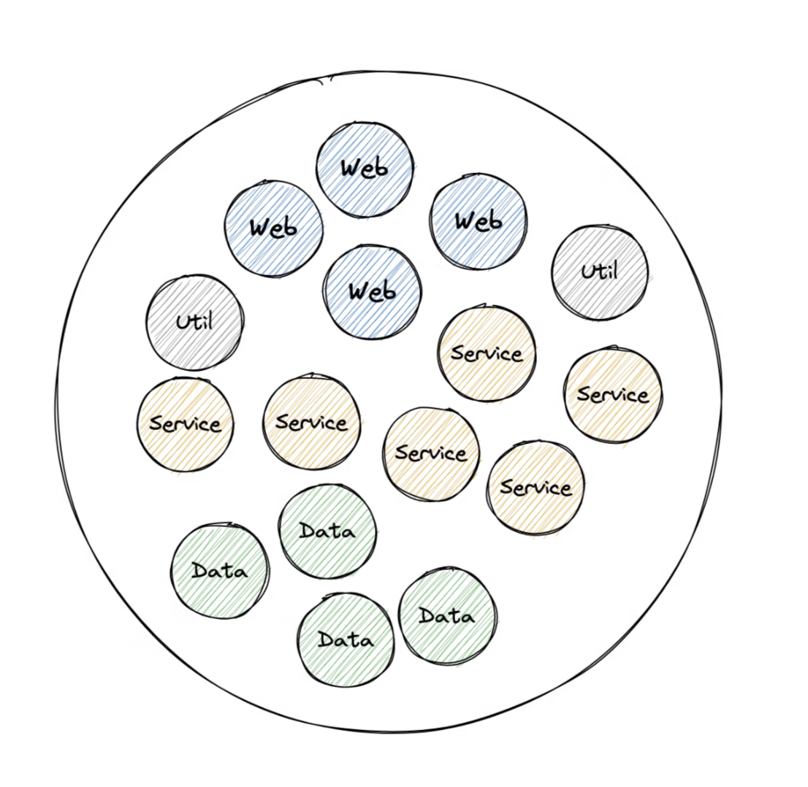
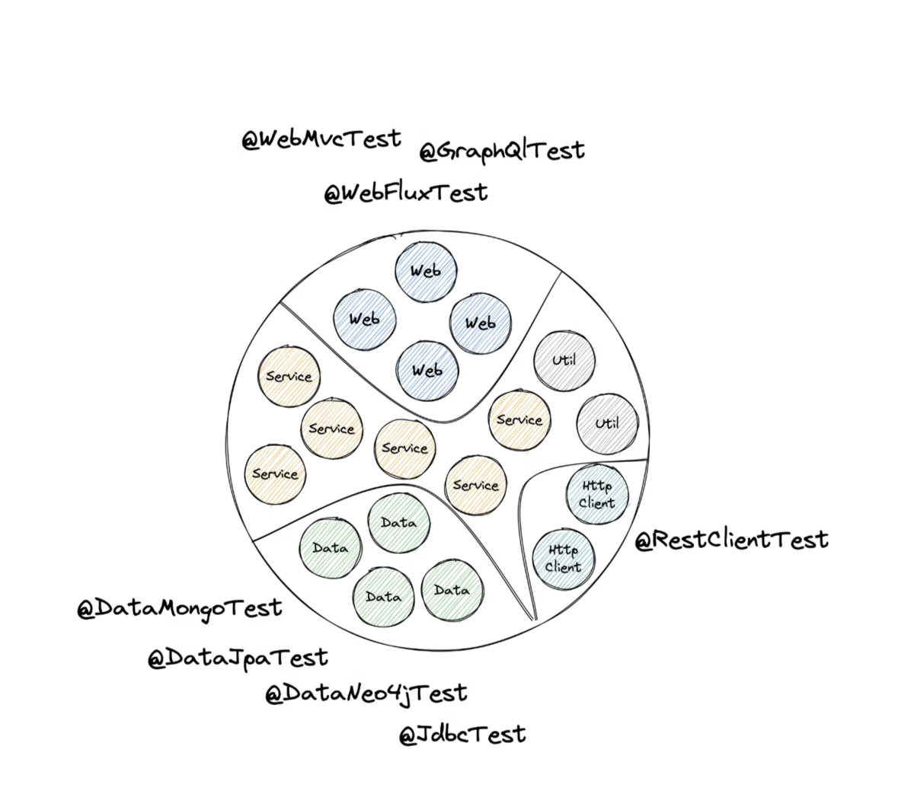
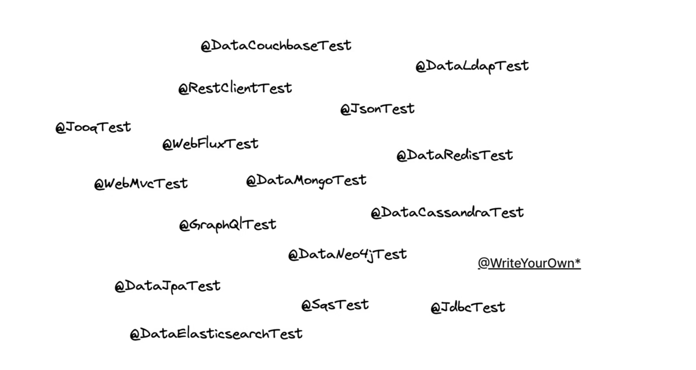

---

<!-- _class: title -->


# Testing Spring Boot Applications Demystified

## First Workshop Day

_Digdir Workshop 02.03.2026_

Philip Riecks - [PragmaTech GmbH](https://pragmatech.digital/) - [@rieckpil](https://x.com/rieckpil)


---

<!-- header: 'Testing Spring Boot Applications Demystified Workshop @ Digdir 02.03.2026' -->
<!-- footer: '' -->


# Lab 2

## Sliced Testing - Verifying the Web Layer

---

## Discuss Exercises from Lab 1

---

## Spring Boot 3 vs. 4: What Changed?

**Modular Starters** — renamed for clarity:

| Spring Boot 3 | Spring Boot 4 |
|---------------|---------------|
| `spring-boot-starter-web` | `spring-boot-starter-webmvc` |
| `spring-boot-starter-test` | `spring-boot-starter-webmvc-test` (+ per-module test starters) |
| `spring-boot-starter-oauth2-client` | `spring-boot-starter-security-oauth2-client` |

**Jackson 3** — package relocation:

| Before | After |
|--------|-------|
| `com.fasterxml.jackson.*` | `tools.jackson.*` |
| `@JsonComponent` | `@JacksonComponent` |
| `Jackson2ObjectMapperBuilderCustomizer` | `JsonMapperBuilderCustomizer` |

---

- `@WebMvcTest` no longer in `org.springframework.boot.test.autoconfigure.web.servlet.WebMvcTest;` but `org.springframework.boot.webmvc.test.autoconfigure.WebMvcTest;`

## Spring Boot 3 vs. 4: More Changes

**Nullability** — JSpecify replaces Spring's own annotations:
- `org.springframework.lang.Nullable` → `org.jspecify.annotations.Nullable`

**Jakarta EE 11** baseline (Servlet 6.1):
- No `javax.*` imports left — already migrated in Boot 3, but now raised to Jakarta EE 11

**Relocated classes** (selected):
- `@EntityScan` → `org.springframework.boot.persistence.autoconfigure.EntityScan`
- `TestRestTemplate` → `org.springframework.boot.resttestclient.TestRestTemplate`
- `@PropertyMapping` → `org.springframework.boot.test.context.PropertyMapping`

**Migration tip**: Add `spring-boot-starter-classic` temporarily to restore the old classpath, fix imports, then remove it.

---

## How Our Application Evolved

In Lab 1, we focused on **unit testing** plain Java classes in isolation:

- `BookService` tested with Mockito mocks
- No Spring context required
- Fast, simple, focused on business logic

Now, our application has grown and includes a **web layer**:

- REST controllers exposing HTTP endpoints
- Spring Security protecting certain routes
- JSON serialization/deserialization of request and response bodies

---

## What Changed Since Lab 1?

```
Lab 1: Service Layer                Lab 2: + Web Layer
┌─────────────────────┐             ┌─────────────────────┐
│   BookService       │             │   BookController     │ ← NEW
│   (Unit Tested ✓)   │             │   SecurityConfig     │ ← NEW
└─────────────────────┘             ├─────────────────────┤
                                    │   BookService        │
                                    │   (Unit Tested ✓)    │
                                    └─────────────────────┘
```

- Controllers handle HTTP requests, validation and serialization
- Security config restricts access to endpoints
- **Question**: Can we unit test all of this effectively?

---

## Unit Testing Has Limits

- **Request Mapping**: Does `/api/books/{isbn}` actually resolve to your desired method?
- **Validation**: Will incomplete request bodies result in a 400 Bad Request or return an accidental 200?
- **Serialization**: Are your JSON objects serialized and deserialized correctly?
- **Headers**: Are you setting Content-Type or custom headers correctly?
- **Security**: Are your Spring Security configuration and other authorization checks enforced?
- etc.

---

## Unit Testing a Controller

```java
@ExtendWith(MockitoExtension.class)
class BookControllerUnitTest {

  @Mock
  private BookService bookService;

  @InjectMocks
  private BookController bookController;

  // We can test the return value...
  // but NOT request mappings, serialization,
  // validation, security, error handling, etc.
}
```

---

<!-- _class: section -->

# A Better Alternative
## Sliced Testing


---

## A Typical Spring Application Context



---



---

## What Is MockMvc?

- A **mocked servlet environment** provided by Spring Test
- Simulates HTTP requests **without starting an actual server** (no real Tomcat)
- Processes the full Spring MVC pipeline: routing, filters, serialization, exception handling
- Allows testing controllers with real HTTP semantics (status codes, headers, body)

```java
mockMvc.perform(get("/api/books/1234")
    .accept(MediaType.APPLICATION_JSON))
  .andExpect(status().isOk())
  .andExpect(jsonPath("$.title").value("Spring Boot Testing"));
```

---

## MockMvc: What Gets Tested?

| Aspect | Unit Test | MockMvc |
|--------|:---------:|:-------:|
| Business logic | ✓ | ✓ |
| Request mapping | ✗ | ✓ |
| JSON serialization | ✗ | ✓ |
| Validation (`@Valid`) | ✗ | ✓ |
| Exception handling | ✗ | ✓ |
| Security filters | ✗ | ✓ |
| Content negotiation | ✗ | ✓ |

---

## Slicing Example: @WebMvcTest

- Testing your web layer in isolation and only load the beans you need
- `MockMvc`: Mocked servlet environment with HTTP semantics

```java
@WebMvcTest(BookController.class)
@Import(SecurityConfig.class)
class BookControllerTest {

  @Autowired
  private MockMvc mockMvc;

  @MockitoBean
  private BookService bookService;

}
```

- See `WebMvcTypeExcludeFilter` for included Spring beans

---



---

## What @WebMvcTest Loads (and What It Doesn't)

**Included** in the sliced context:
- `@Controller`, `@RestController`, `@ControllerAdvice`
- `@JsonComponent`, `Converter`, `Filter`
- `WebMvcConfigurer`, `HandlerMethodArgumentResolver`

**Excluded** from the sliced context:
- `@Service`, `@Repository`, `@Component`
- `DataSource`, `EntityManager`, JPA repositories
- Any non-web Spring beans

Use `@MockitoBean` to provide mocks for excluded dependencies.

---

## Strategies for Adding Missing Beans to a Slice

| Strategy | When to Use |
|----------|-------------|
| `@MockitoBean` | Replace a dependency with a Mockito mock — most common approach |
| `@SpyBean` | Wrap the real bean to verify interactions while keeping real behavior |
| `@TestConfiguration` + `@Bean` | Provide a custom bean definition scoped to your test |
| `@Primary` in a test config | Override an existing bean with a test-specific implementation |
| In-memory implementation | Implement the interface yourself (e.g., `InMemoryBookRepository`) |

---

## Adding Missing Beans: Code Examples

```java
// 1. Mock — no real behavior
@MockitoBean
private BookService bookService;

// 2. Spy — real behavior + verification
@SpyBean
private BookService bookService;

// 3. TestConfiguration — custom bean for the test
@TestConfiguration
static class TestConfig {
  @Bean
  public BookService bookService() {
    return new BookService(new InMemoryBookRepository());
  }
}

// 4. In-memory implementation — useful for repositories
public class InMemoryBookRepository implements BookRepository {
  private final Map<String, Book> store = new HashMap<>();
  // implement interface methods backed by the map
}
```

---

## Testing Security with @WebMvcTest

- `@WebMvcTest` auto-configures Spring Security (if on classpath)
- By default, all endpoints require authentication
- Use `@Import(SecurityConfig.class)` to load your actual security rules

```java
@WebMvcTest(BookController.class)
@Import(SecurityConfig.class)
class BookControllerSecurityTest {

  @Autowired
  private MockMvc mockMvc;

  @MockitoBean
  private BookService bookService;

  @Test
  void shouldRejectUnauthenticatedAccess() throws Exception {
    mockMvc.perform(get("/api/books"))
      .andExpect(status().isUnauthorized());
  }
}
```

---

## Simulating Authenticated Users

Spring Security Test provides annotations and request post-processors:

```java
@Test
@WithMockUser(roles = "ADMIN")
void shouldAllowAdminToDeleteBook() throws Exception {
  mockMvc.perform(delete("/api/books/1234"))
    .andExpect(status().isNoContent());
}

@Test
@WithMockUser(roles = "USER")
void shouldForbidRegularUserFromDeletingBook() throws Exception {
  mockMvc.perform(delete("/api/books/1234"))
    .andExpect(status().isForbidden());
}
```

---

## Security Testing Options

| Approach | Use Case |
|----------|----------|
| `@WithMockUser` | Quick mock with roles/authorities |
| `@WithMockUser(username, roles)` | Customized mock principal |
| `SecurityMockMvcRequestPostProcessors.jwt()` | Test JWT-based authentication |
| No annotation | Verify unauthenticated access is rejected |

---

## Spring Security Test: Under the Hood

All these testing utilities work the same way under the hood:

```java
// What @WithMockUser and SecurityMockMvcRequestPostProcessors do internally
SecurityContext context = SecurityContextHolder.createEmptyContext();

context.setAuthentication(
  new UsernamePasswordAuthenticationToken("user", "password",
    List.of(new SimpleGrantedAuthority("ROLE_USER")))
);

SecurityContextHolder.setContext(context);
```

- `SecurityContextHolder` stores the authentication per thread (`ThreadLocal`)
- Before the test runs, the mock authentication is placed on the current thread
- Spring Security filters then read from this context as if a real login happened
- After the test, the context is cleaned up automatically

---

## Common Test Slices

- `@WebMvcTest` - Controller layer
- `@DataJpaTest` - Repository layer
- `@JsonTest` - JSON serialization/deserialization
- `@RestClientTest` - RestTemplate testing
- `@WebFluxTest` - WebFlux controller testing
- `@JdbcTest` - JDBC testing

---

## @WebMvcTest Beyond REST: Testing Thymeleaf with HtmlUnit

`@WebMvcTest` also auto-configures an HtmlUnit `WebClient` — great for testing server-side rendered pages:

```java
@WebMvcTest(BookCatalogController.class)
@Import(SecurityConfig.class)
class BookCatalogControllerHtmlUnitTest {

  @Autowired
  private WebClient webClient; // auto-configured by @WebMvcTest

  @MockitoBean
  private BookService bookService;

  @Test
  @WithMockUser
  void shouldRenderBookCatalogPageWithAllBooks() throws Exception {
    given(bookService.getAllBooks()).willReturn(List.of(
      new Book("978-0-13-468599-1", "Effective Java", "Joshua Bloch",
        LocalDate.of(2018, 1, 6))
    ));

    HtmlPage page = webClient.getPage("/books");

    assertThat(page.getTitleText()).isEqualTo("Book Catalog");
    assertThat(page.getBody().getTextContent()).contains("Effective Java");

    HtmlTable table = page.getFirstByXPath("//table");
    assertThat(table.asNormalizedText()).contains("978-0-13-468599-1");
  }
}
```

Requires `org.htmlunit:htmlunit` on the test classpath (version managed by Spring Boot).

---

# Time For Some Exercises
## Lab 2

- Work with the same repository as in lab 1
- Navigate to the `labs/lab-2` folder in the repository and complete the tasks as described in the `README` file of that folder
- Time boxed until the end of the lunch break (14:00 AM)
