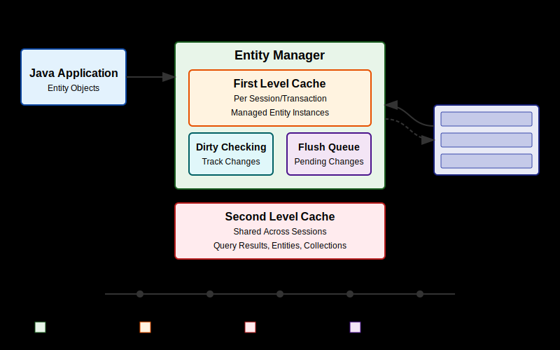

---


<!-- _class: title -->


# Testing Spring Boot Applications Demystified

## Lab 3

_Digdir Workshop 02.03.2026_

Philip Riecks - [PragmaTech GmbH](https://pragmatech.digital/) - [@rieckpil](https://x.com/rieckpil)

---

## Discuss Exercises from Lab 2

- Exercise 1: `@WebMvcTest`
  - Test that only admins can delete books
  - Test that regular users or unauthenticated users can't delete books
  - Test that books can be created successfully with proper JSON data

---


# Lab 3

## Sliced Testing Continued

### Verifying the Persistence Layer with `@DataJpaTest` 

---


## Enriching the Application

- **H2** and **PostgreSQL** added as infrastructure dependency (`compose.yaml`)
- **Flyway** for versioned schema migrations (`src/main/resources/db/migration/`)
- **JPA entity** mapped to the `books` table
- **Spring Data JPA repository** with basic CRUD and a custom query

---

## What to Verify for our Persistence Layer?

```java
public interface BookRepository extends JpaRepository<Book, Long> {
}
```

- Spring Data query methods (`findByIdOrderByPublishedDateAsc`) → already abstracted, **no need to test**
- Complex entity graphs and Hibernate associations
- Mapping of entities to database columns
- Native (database-specific) queries
- Potential N+1 issues
- Transaction behaviour & connection pool usage in isolation

---


## Spring Data Abstraction

- Spring Data already tests its own CRUD and derived query methods
- No need to write tests for `findById`, `save`, `findAll`, etc.
- Focus your test effort on **your own business logic**:
  - Custom `@Query` methods
  - Projections and DTOs
  - Complex filtering and sorting logic
- Don't test the framework - test your code that uses the framework

---

## Complex Entity Graphs

```java
@Entity
@Table(name = "books")
public class Book {
}
```

- Hibernate associations require careful verification:
  - `@OneToMany`, `@ManyToMany`, `@ManyToOne`
  - Cascade types (`CascadeType.PERSIST`, `CascadeType.REMOVE`)
  - Orphan removal (`orphanRemoval = true`)
- Bidirectional mappings must be consistent on both sides
- Consider the [Hypersistence Optimizer](https://vladmihalcea.com/hypersistence-optimizer/) for advanced Hibernate using analytics

---


## Entity-to-Column Mapping

- Verify that JPA annotations match the actual DDL:
  - **Column names**: `@Column(name = "...")`
  - **Types**: correct Java <-> SQL type mapping
  - **Nullability**: `@Column(nullable = false)` enforced by the DB
  - **Unique constraints**: `@Column(unique = true)` or `@Table(uniqueConstraints = ...)`
  - **Enum strategies**: `@Enumerated(EnumType.STRING)` vs `ORDINAL`

---


## Native SQL Queries


```java
@Query(value = """
  SELECT * FROM books
  WHERE to_tsvector('english', title) @@ plainto_tsquery('english', :searchTerms)
  ORDER BY ts_rank(to_tsvector('english', title), plainto_tsquery('english', :searchTerms)) DESC
  """,
  nativeQuery = true)
List<Book> searchBooksByTitleWithRanking(@Param("searchTerms") String searchTerms);
```

- Native SQL bypasses JPQL and is **database-engine specific**
- Must be tested against a real database engine:
  - PostgreSQL full-text search (`to_tsvector`, `plainto_tsquery`)
  - Window functions (`ROW_NUMBER()`, `RANK()`)
  - JSON operators, array types, and other vendor extensions

---

## N+1 Issues

- Lazy loading can trigger unexpected extra `SELECT` statements
- A single call that returns N entities may fire N additional queries
- Strategies to detect N+1 in tests:
  - Enable Hibernate statistics and assert query counts
  - Use `@EnabledIf` to conditionally run query-count assertions
  - Log SQL with `spring.jpa.show-sql=true` and review output
- Fix with `JOIN FETCH`, `@EntityGraph`, or eager loading where appropriate

---

## How to Verify Persistence Layer in Isolation?

- What database should we use for testing? In-memory or real?
- How to manage test data setup and cleanup?
- How to test native queries and database-specific features?
- How to make it work on CI and locally without external setup efforts?

---

## Introducing `@DataJpaTest`

- Sliced test annotation for JPA repositories
- `@JooqTest`, `@JdbcTest` for non-JPA persistence layers
- Similar annotations exist for MongoDB, Redis, Cassandra, etc.

What's inside?

- Auto-configures in-memory database
- Provides a `TestEntityManager` for convenient entity operations
- Verify JPA entity mapping, creation and native queries
- Uses `@Transactional` by default for all tests → rolls the transactions back after each test

---

## A Sample `@DataJpaTest`

```java
@DataJpaTest
class BookRepositoryTest {
  
  @Autowired
  private TestEntityManager entityManager;
    
  @Autowired
  private BookRepository bookRepository;
  
}
```

... but which database should we use?

---


## In-Memory vs. Real Database

- By default, Spring Boot tries to autoconfigure an in-memory relational database (H2 or Derby)
- In-memory database pros:
  - Easy to use & fast
  - Less overhead
- In-memory database cons:
  - Mismatch with the infrastructure setup in production
  - Despite having compatibility modes, we can't fully test proprietary database features

---


## Testcontainers to the Rescue!

```java
static PostgreSQLContainer<?> postgres = new PostgreSQLContainer<>("postgres:16-alpine");
```

- Java library that manages **Docker containers** from inside Java code
- Container lifecycle is tied to the test: starts before, stops after
- `static` containers are shared across all tests in the class (faster)
- [Modules](https://testcontainers.com/modules/) for PostgreSQL, MySQL, Redis, Kafka, LocalStack, and more
- Eliminates the "works on my machine" database problem

---

## Testcontainers 101

- Running infrastructure components (databases, message brokers, etc.) in Docker containers for our tests becomes a breeze with [Testcontainers](https://testcontainers.com/)
- Testcontainers abstracts the rather low-level Docker Java API and provides a fluent, Java-friendly API to define and manage containers in our tests
- Whatever you can containerize, you can test with Testcontainers

Testcontainers maps the container's internal ports to random ephemeral ports on the host machine to avoid conflicts.

You can see the mapped ports with `docker ps`:

```shell {3}
$ docker ps
CONTAINER ID   IMAGE                        COMMAND                  CREATED          STATUS         PORTS                                           NAMES
a958ee2887c6   postgres:16-alpine           "docker-entrypoint.s…"   10 seconds ago   Up 9 seconds   0.0.0.0:32776->5432/tcp, [::]:32776->5432/tcp   affectionate_cannon
ad0f804068dc   testcontainers/ryuk:0.12.0   "/bin/ryuk"              10 seconds ago   Up 9 seconds   0.0.0.0:32775->8080/tcp, [::]:32775->8080/tcp   testcontainers-ryuk-1f9f76a6-46d4-4e19-85c1-e8364da12804
```

---

## Testcontainers & Spring Boot Integration

```java {2,5,6}
@DataJpaTest
@Testcontainers
class BookRepositoryTest {

  @Container
  @ServiceConnection
  static PostgreSQLContainer<?> postgres =
      new PostgreSQLContainer<>("postgres:16-alpine");

}
```

- `@Testcontainers` hooks the container into the JUnit 5 extension lifecycle
- `@ServiceConnection` reads host/port from the running container and **auto-configures** Spring's datasource - no manual URL wiring needed

---

## Alternative Connection Configuration

Alternatively, we can use `@DynamicPropertySource` to programmatically set properties from the container:

```java
static PostgreSQLContainer<?> database =
  new PostgreSQLContainer<>("postgres:17.2")
    .withDatabaseName("test")
    .withUsername("duke")
    .withPassword("s3cret");

@DynamicPropertySource
static void properties(DynamicPropertyRegistry registry) {
  registry.add("spring.datasource.url", database::getJdbcUrl);
  registry.add("spring.datasource.password", database::getPassword);
  registry.add("spring.datasource.username", database::getUsername);
}
```

---

## Putting it All Together

Writing our first `@DataJpaTest`, answering the question, can we store and retrieve our JPA entity?

What could go wrong?

```java
@Test
void shouldStoreAndRetrieveEntity() {
  Book book = new Book("978-1-2345-6789-0", "Spring Boot Testing", "Test Author", LocalDate.of(2023, 1, 1));
  book.setStatus(BookStatus.AVAILABLE);

  bookRepository.save(book);

  Optional<Book> foundBook = bookRepository.findByIsbn("978-1-2345-6789-0");

  assertThat(foundBook).isPresent();
}
```

---




---


## Useful Log Levels for Persistence Tests

```xml
<configuration>
  <include resource="org/springframework/boot/logging/logback/defaults.xml"/>
  <include resource="org/springframework/boot/logging/logback/console-appender.xml"/>

  <root level="INFO">
    <appender-ref ref="CONSOLE"/>
  </root>
  
  <logger name="org.springframework.transaction.interceptor" level="TRACE"/>
  <logger name="org.springframework.transaction" level="DEBUG"/>
  <logger name="org.springframework.data.jpa.repository.query" level="DEBUG"/>
  <logger name="org.springframework.orm.jpa" level="DEBUG"/>
  
  <logger name="jakarta.persistence.EntityManager" level="DEBUG"/>
  
  <logger name="org.hibernate.Session" level="DEBUG"/>
  <logger name="org.hibernate.event.internal" level="DEBUG"/>
  <logger name="org.hibernate.orm.jdbc.bind" level="TRACE"/>
  
  <logger name="com.zaxxer.hikari" level="DEBUG"/>
</configuration>
```
---

## Highlight SQL in Logs

```yaml
spring:
  jpa:
    properties:
      hibernate:
        format_sql: true
        highlight_sql: true

```

---


## Test Data Management

- Each test should start with a known state
- Tests should not interfere with each other
- Options:
  - Truncate tables between tests
  - Transaction rollback (`@Transactional`)
  - Separate schemas per test
  - Database resets

---

## Preparing Test Data

**`@Sql` - declarative SQL scripts**

```java
@Test
@Sql("/data/sample-books.sql")
void shouldReturnAllAvailableBooks() { ... }
```

- `@Sql` is ideal for fixed seed data and complex multi-table setups

**Repository / `TestEntityManager` - programmatic**

```java
@BeforeEach
void setUp() {
  bookRepository.save(new Book("978-0-13-235088-4", "Clean Code", "Robert C. Martin", LocalDate.of(2008, 8, 1)));
}
```

- Programmatic setup gives full type safety, improved maintainability when refactoring entities and IDE support

---

## Cleaning Up Test Data

**`@Transactional` on the test — rollback after each test, no commit**

```java
@DataJpaTest    // already wraps each test in a transaction
@Transactional  // add explicitly on @SpringBootTest tests
class BookRepositoryTest {  }
```

- The transaction is rolled back after each test → database stays clean

**When committed state must be verified:**

```java
@Test
@Commit               // or @Rollback(false)
void shouldPersistAuditTimestampAfterCommit() {  }
```

---

## Testing Native Queries

Your upcoming exercise will involve testing a native query that uses PostgreSQL's full-text search capabilities: 

```java
/**
 * PostgreSQL-specific: Full text search on book titles with ranking.
 * Uses PostgreSQL's to_tsvector and to_tsquery for sophisticated text searching
 * with ranking based on relevance.
 *
 * @param searchTerms the search terms (e.g. "adventure dragons fantasy")
 * @return list of books matching the search terms, ordered by relevance
 */
@Query(value = """
  SELECT * FROM books
  WHERE to_tsvector('english', title) @@ plainto_tsquery('english', :searchTerms)
  ORDER BY ts_rank(to_tsvector('english', title), plainto_tsquery('english', :searchTerms)) DESC
  """,
  nativeQuery = true)
List<Book> searchBooksByTitleWithRanking(@Param("searchTerms") String searchTerms);
```

---

## Other Slices Worth Knowing: `@JsonTest`

```java
@JsonTest
class BookJsonTest {

  @Autowired
  private JacksonTester<Book> bookJson;

  @Test
  void shouldSerializeBookStatusAsStringWhenWritingBook() throws Exception {
    Book book = new Book("978-0-13-235088-4", "Clean Code", "Robert C. Martin",
      LocalDate.of(2008, 8, 1));

    assertThat(bookJson.write(book))
      .extractingJsonPathStringValue("$.status")
      .isEqualTo("AVAILABLE");
  }
}
```

- Loads only Jackson configuration, `@JsonComponent`, mixins

---

## Other Slices Worth Knowing: `@RestClientTest`

```java
@RestClientTest(BookApiClient.class)
class BookApiClientTest {

  @Autowired private BookApiClient cut;
  @Autowired private MockRestServiceServer server;

  @Test
  void shouldReturnBooksFromRemoteApi() {
    server.expect(requestTo("/api/books"))
      .andRespond(withSuccess("""[{"isbn": "978-0-13-235088-4", "title": "Clean Code"}]""",
        MediaType.APPLICATION_JSON));

    assertThat(cut.fetchAll()).hasSize(1);
  }
}
```

- Loads only the target client bean + `MockRestServiceServer`

---

## Keep the Main Class Clean

**Problem:** infrastructure config placed on the main class leaks into every slice

```java
@SpringBootApplication
@EnableJpaAuditing          // ← this will break @WebMvcTest — JPA context required
public class Lab3Application { ... }
```

**Fix:** move it into a dedicated `@Configuration` class

```java
@Configuration
@EnableJpaAuditing
class JpaConfig { }
```

- `@WebMvcTest` and `@JsonTest` slices no longer need JPA on the classpath
- Keeps `@SpringBootApplication` as a pure entry point - no cross-cutting concerns

---

## Summary: Sliced Testing

- **Core Concept**: Test a specific "slice" or layer of your application by loading a minimal, relevant part of the Spring `ApplicationContext`.

- **Confidence Gained**: Helps validate parts of your application where pure unit testing is insufficient, like the web, messaging, or data layer.

- **Prominent Examples:** Web layer (`@WebMvcTest`) and database layer (`@DataJpaTest`)

- **Pitfalls**: Requires careful configuration to ensure only the necessary slice of the context is loaded.

- **Tools**: JUnit, Mockito, Spring Test, Spring Boot, Testcontainers

---

# Time For Some Exercises
## Lab 3

- Work with the same repository as in lab 1/lab 2
- Navigate to the `labs/lab-3` folder in the repository and complete the tasks as described in the `README` file of that folder
- Time boxed until the end of the coffee break (15:30)
