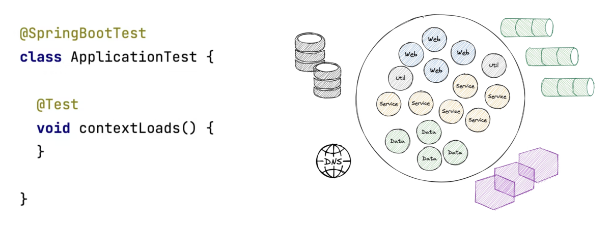

---


<!-- _class: title -->


# Testing Spring Boot Applications Demystified

## Lab 4

_Digdir Workshop 02.03.2026_

Philip Riecks - [PragmaTech GmbH](https://pragmatech.digital/) - [@rieckpil](https://x.com/rieckpil)

---

<!-- header: 'Testing Spring Boot Applications Demystified Workshop @ Digdir 02.03.2026' -->
<!-- footer: '' -->

## Discuss Exercises from Lab 3

- Data JPA Test to test native SQL query

---


# Lab 4

## Integration Testing Part I

### Testing Against the Entire Application Context

---


## Enriching the Application

- **OpenLibrary API client** (`WebClient`) fetches book metadata from a remote API
- **Book entity** gains `description` and `thumbnailUrl` columns (Flyway `V002`)
- **HTTP on startup**: `CommandLineRunner` pre-fetches metadata for 3 ISBNs on every context start
- **Security**: endpoints protected by roles - imagine an OAuth2 resource server

---

<!-- _class: section -->

# Starting Everything
## Booting the Entire `ApplicationContext`


---

<!--

Notes:

-->

## The Default Integration Test



---


## Challenges: Starting a Full Context

1. **HTTP calls during context launch and tests** → external API may be unavailable in CI/offline
2. **Infrastructure dependencies** → databases, caches, message brokers
3. **Security** → OAuth2, JWT, Basic Auth, role-protected endpoints
4. **Data preparation & cleanup** → consistent, isolated state between tests
5. **Speed** → keeping the build times reasonable

---

## Introducing: Microservice HTTP Communication

```java
public BookMetadataResponse getBookByIsbn(String isbn) {
  String bibKey = "ISBN:" + isbn;
  
  Map<String, BookMetadataResponse> result = webClient.get()
    .uri(uriBuilder -> uriBuilder
      .path("/api/books")
      .queryParam("bibkeys", bibKey)
      .queryParam("format", "json")
      .queryParam("jscmd", "data")
      .build())
    .retrieve()
    .bodyToMono(new ParameterizedTypeReference<Map<String, BookMetadataResponse>>() {})
    .block();
  
  return result != null ? result.get(bibKey) : null;
}
```

---

## Challenge 1: HTTP Communication during Tests

```java
@Bean
public CommandLineRunner initializeBookMetadata() {
  return args -> {
    // Fires real HTTP to https://openlibrary.org on every context start
    openLibraryApiClient.getBookByIsbn("9780132350884");
    openLibraryApiClient.getBookByIsbn("9780201633610");
    openLibraryApiClient.getBookByIsbn("9780134757599");
  };
}
```

- Context fails to start when the remote API is **unreachable** (CI, airplane mode)
- Tests become **non-deterministic** - dependent on external state and sample data
- Solution: stub the HTTP calls **before** the Spring context finishes starting

---

## HTTP Communication During Tests

- Unreliable when performing real HTTP calls during tests
- Sample data - what if the remote API changes its response?
- Authentication - real API keys in CI pipelines?
- Cleanup - data written to external systems
- No airplane-mode testing possible
- Solution: **stub the HTTP responses** for the remote system

---

## Why Offline / Airplane Mode Matters

- Tests should pass **anywhere**: laptop, CI/CD pipeline, air-gapped environments
- Real network calls make tests:
  - **Slow** - latency accumulates across a large suite
  - **Flaky** - rate limits, API downtime, responses that change over time
  - **Insecure** - credentials leak into logs, data written to external systems
- **Rule:** no test should require an outbound network connection

---


---

## Introducing WireMock

- In-memory (or Docker container) Jetty to stub HTTP responses to simulate a remote HTTP API
- Simulate failures, slow responses, etc.
- Alternatives: MockServer, MockWebServer, etc.

```java
WireMockServer wireMockServer = new WireMockServer(wireMockConfig().dynamicPort());
wireMockServer.start();

// Feels a bit like Mockito, but for HTTP stubbing
wireMockServer.stubFor(
  WireMock.get(urlPathEqualTo("/api/books"))
    .withQueryParam("bibkeys", WireMock.equalTo("ISBN:" + isbn))
    .willReturn(
      aResponse()
        .withHeader("Content-Type", MediaType.APPLICATION_JSON_VALUE)
        .withBodyFile(isbn + "-success.json")))
);
```

---

## WireMock: Advanced Features

**Stateful scenarios** - simulate retry / eventual consistency

```java
wireMockServer.stubFor(get("/isbn/123")
  .inScenario("retry").whenScenarioStateIs(STARTED)
  .willReturn(serverError())
  .willSetStateTo("recovered"));

wireMockServer.stubFor(get("/isbn/123")
  .inScenario("retry").whenScenarioStateIs("recovered")
  .willReturn(ok().withBodyFile("123-success.json")));
```

---

**Response templating** - inject request values into the response body

```java
wireMockServer.stubFor(get(urlPathMatching("/users/.*"))
  .willReturn(aResponse()
    .withHeader("Content-Type", "application/json")
    .withBody(
        {
          "id": "{{request.pathSegments.[1]}}",
          "userAgent": "{{request.headers.User-Agent}}",
          "timestamp": "{{now format='yyyy-MM-dd'}}"
        }
       )
    .withTransformers("response-template")));
```

---

**Proxying & Recording** - record real API responses once, replay offline

```java
wireMockServer.startRecording(RecordSpec.forTarget("https://openlibrary.org/")
    .makeStubsPersistent(true)
    .build());

// ... make real requests ...

wireMockServer.stopRecording();
```

---

## Making Our Application Context Start

- Stubbing HTTP responses during the launch of our Spring Context
- Introducing a new building block: `ApplicationContextInitializer`

```java
WireMockServer wireMockServer = new WireMockServer(wireMockConfig().dynamicPort());
wireMockServer.start();

applicationContext.addApplicationListener(event -> {
  if (event instanceof ContextClosedEvent) {
    wireMockServer.stop();
  }
});

// Configure stubs before Spring beans initialise
new OpenLibraryApiStub(wireMockServer).stubForSuccessfulBookResponse("9780132350884");

TestPropertyValues.of(
  "book.metadata.api.url=http://localhost:" + wireMockServer.port()
).applyTo(applicationContext);
```

---

## Challenge 2: Infrastructure Dependencies

```java
@TestConfiguration
class PostgresTestcontainerConfig {

  @Bean
  @ServiceConnection
  PostgreSQLContainer<?> postgresContainer() {
    return new PostgreSQLContainer<>("postgres:16-alpine")
        .withInitScript("init-postgres.sql");
  }
}
```

- Provide external infrastructure dependencies (databases, caches, message brokers) via **Testcontainers**
- Declare `static` containers to share across tests in a class → faster suites
- Same image version as production: eliminates "works on my machine" surprises

---

## Using `@SpringBootTest` to Start the Entire Context

To start the Servlet Container or not?

We can control the web environment of our context setup with `@SpringBootTest`:

```java
@SpringBootTest                                                // MOCK (default)
@SpringBootTest(webEnvironment = WebEnvironment.RANDOM_PORT)   // real HTTP, random port
@SpringBootTest(webEnvironment = WebEnvironment.DEFINED_PORT)  // real HTTP, static port
@SpringBootTest(webEnvironment = WebEnvironment.NONE)          // no web layer at all
```


---


| Mode | Web server                                    | Real HTTP | Test client                                             |
|---|-----------------------------------------------|---|---------------------------------------------------------|
| `MOCK` *(default)* | Mock servlet environment                      | ❌ | `MockMvc`                                               |
| `NONE` | No servlet                                    | ❌ | none (service/batch tests)                              |
| `RANDOM_PORT` | Real embedded servlet container (e.g. Tomcat) | ✅ | `WebTestClient` / `RestTestClient` / `TestRestTemplate` |
| `DEFINED_PORT` | Real embedded container (e.g. Tomcat)                          | ✅ | `WebTestClient` / `RestTestClient`/ `TestRestTemplate`  |

Two variants matter for nearly every integration test: **`MOCK`** and **`RANDOM_PORT`**.


---

## Variant 1: `MOCK` - No Real Servlet Container, No Real HTTP

- The integration tests starts the entire `ApplicationContext` but **does not start a real HTTP server**
- Instead, it uses `MockMvc` to simulate HTTP requests in a mocked servlet environment, similar to `@WebMvcTest` but with the full context loaded.

```java
@SpringBootTest
@AutoConfigureMockMvc
class SampleIT {

  @Autowired
  private MockMvc mockMvc;
  
  @Test
  void sampleTest() {
    // test against your entire application, using a mocked servlet environment
  }
}
```

---

## Variant 2: `RANDOM_PORT` - Entire Context with Servlet Container

```java
@SpringBootTest(webEnvironment = SpringBootTest.WebEnvironment.RANDOM_PORT)
@AutoConfigureWebTestClient // choose one
@AutoConfigureTestRestTemplate // choose one
@AutoConfigureRestTestClient // choose one
class SampleIT {

  @LocalServerPort
  private int port;
  
  @Autowired
  private WebTestClient webTestClient; // <- auto-configured for the random port

  @Test
  void sampleTest() {
    this.webTestClient.get().uri("/api/books").exchangeSuccessfully();
  }
}
```

---


## Wrap-Up: Day 1

**Lab 1: Unit Testing with Spring Boot**

- Automated testing helps shipping code faster with more confidence
- `spring-boot-starter-test` comes with batteries included: JUnit 5, AssertJ, Mockito, Spring Test, etc.
- JUnit Jupiter extensions offer a flexible way to outsource cross-cutting testing concerns
- Effective unit testing requires thoughtful design: constructor injection, small classes, clear separation of concerns, avoiding static call
- Maven Surefire (unit) vs. Failsafe (integration `*IT.java`) plugins

---

**Lab 2: Sliced Testing with `@WebMvcTest`**

- Unit testing is not sufficient for all parts of our application, see the web layer
- Slice testing loads only relevant beans for a particular layer → faster and more focused tests
- `@WebMvcTest` loads the web layer only - no service or repository beans
- `MockMv`c: acts is a mocked servlet environment to test controllers without starting a server
- `@MockitoBean` stubs the service layer
- Spring Security: `@WithMockUser`, `.with(jwt())`, `.with(csrf())`
- Validates HTTP status, JSON paths, headers, and error responses

---

**Lab 3: Sliced testing the Persistence Layer: `@DataJpaTest`**

- Loads JPA layer (`DataSource`, `EntityManager`, `Repository`, ...) only - no web, no security
- `@Transactional` by default → each test rolls back automatically
- Replace H2 with a real Postgres via **Testcontainers** + `@ServiceConnection`
- `TestEntityManager` for low-level entity manipulation
- `@Sql` for declarative test data loading
- Focus on the following for your repository tests: native queries, complex mapping, n+1 problems, don't test Spring Data JPA itself
- There are more test slices like `@JsonTest` or `@RestClientTest`

---


**Lab 4: Integration Testing Part I - Booting the Entire Context**

- Integration tests start the entire `ApplicationContext` - closest to production
- **WireMock**: stubs outbound HTTP to make tests deterministic and offline-capable
- **Testcontainers**: Manage external infrastructure dependencies in tests with real images
- **`ApplicationContextInitializer`**: registers WireMock stubs before beans are initialised
- `@SpringBootTest` comes with two general options:
  - `webEnvironment = WebEnvironment.MOCK` → no real HTTP server, use `MockMvc`
  - `webEnvironment = WebEnvironment.RANDOM_PORT` → real HTTP server on random port, use `TestRestTemplate` or `WebTestClient`

---

<!-- _class: section -->

# See You Tomorrow!

## Day 2 starts at 09:00

_Optional exercise for lab 4: Learn how to use WireMock with `Exercise1WireMockTest`_
