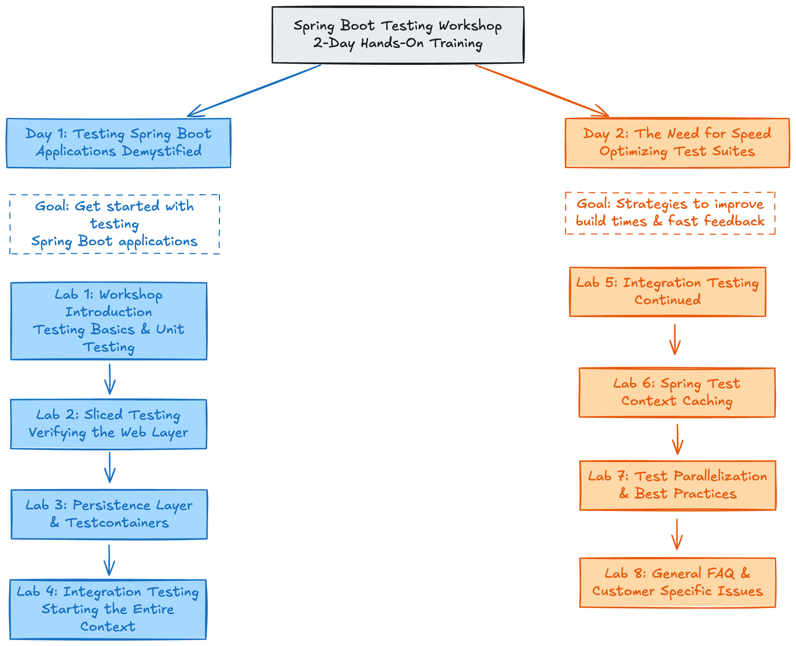
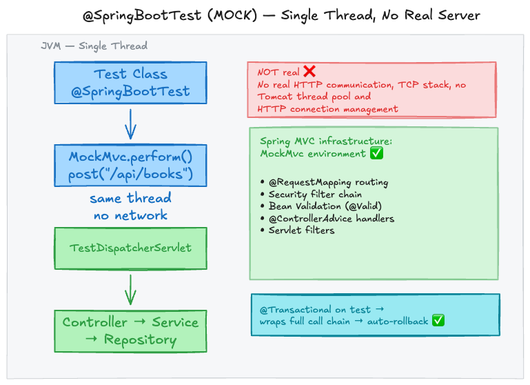
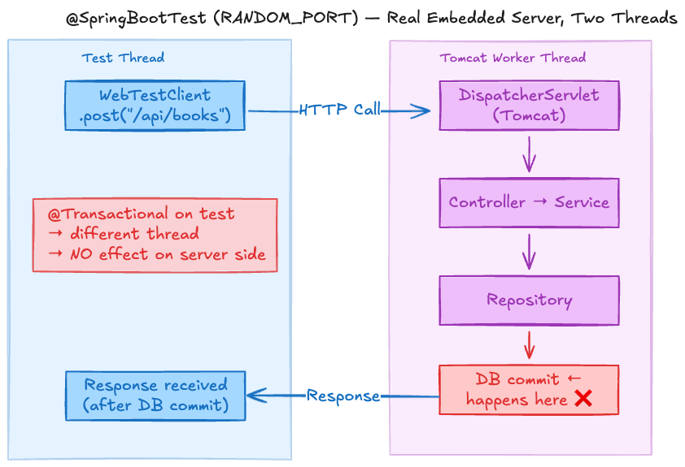

---

<!-- _class: title -->


# Testing Spring Boot Applications Demystified

## Lab 5

_Digdir Workshop 03.03.2026_

Philip Riecks - [PragmaTech GmbH](https://pragmatech.digital/) - [@rieckpil](https://x.com/rieckpil)

---

<!-- header: 'Testing Spring Boot Applications Demystified Workshop @ Digdir 03.03.2026' -->
<!-- footer: '' -->

## Day 1 Recap

- Spring Boot Starter Test aka. Testing Swiss Army Knife
- Maven & Java Testing Conventions
- Sliced testing to focus on isolated parts of the application
- `@WebMvcTest` for controllers, `@DataJpaTest` for repositories, `@RestClientTest` for HTTP clients
- Testcontainers for real infrastructure dependencies (Postgres, Redis, WireMock)
- WireMock for stubbing external HTTP APIs - offline and deterministic
- `@SpringBootTest` for full context integration tests - boots everything, closest to production, but slowest to start


---




---

### Planned Timeline for the Second Workshop Day

- 9:00 - 10:30: **Integration Testing Continued - Verify the Entire Application**
- 10:30 - 11:00: **Coffee Break & Time for Exercises**
- 11:00 - 12:30: **Understanding Spring TestContext Context Caching for fast Tests**
- 12:30 - 13:30: **Lunch**
- 13:30 - 15:00: **Strategies for Fast and Reproducible Spring Boot Test Suites**
- 15:00 - 15:30: **Coffee Break & Time for Exercises**
- 15:30 - 16:30: **General Spring Boot Testing Tips & Tricks and Q&A**

Each 90-minute lab session will include a mix of explanations, demonstrations, and hands-on exercises.

---


## Where We Left Off - End of Lab 4

Lab 4 introduced `@SpringBootTest` and solved its four main challenges. 

Here is what we have so far:

```java
@SpringBootTest
@Import(LocalDevTestcontainerConfig.class)                              // ✅ real Postgres via Testcontainers
@ContextConfiguration(initializers = WireMockContextInitializer.class)  // ✅ WireMock stubs before beans init
class BookControllerIT { ... }
```

**What we haven't covered yet:**

- How to use **MockMvc** vs. **WebTestClient**/**TestRestTemplate**
- Data preparation and cleanup strategies for both setup
- How to customise the context per test (properties, beans, profiles)

---


# Lab 5

## Integration Testing Continued

### Verify the Entire Application

---

## The Bigger Picture - Understanding `@SpringBootTest`

`webEnvironment = MOCK` (default) - no real HTTP server, all calls happen in the test thread. 




---

`webEnvironment = RANDOM_PORT` Tomcat starts on a random port, tests make real HTTP calls over the network to the server thread.




---

## How to Handle Security for Integration Tests?

Options for `MOCK` web environment:

- Follow similar strategies as with `@WebMvcTest` - mock the security context with `@WithMockUser` or `.with(jwt())`

```java
mockMvc.perform(get("/api/books/1")
    .with(jwt().authorities(new SimpleGrantedAuthority("ROLE_USER"))))
  .andExpect(status().isOk());

// Annotation shortcut
@WithMockUser(roles = "USER")
void shouldReturnBook() { ... }
```

---

## How to Handle Security for Integration Tests?

Options for `RANDOM_PORT` web environment:

- Spring Security Test "hacks" no longer work as the test thread is different from the server thread
- Actual test setup depends on the used authentication mechanism:
  - **OAuth2 Resource Server** - every request must carry a valid and signed JWT
  - **Basic Auth** - provide test users
  - **API Keys** - provide test keys

---

## OAuth2 Security Option #1 for Integration Tests

Mock the `JwtDecoder` to always return a valid `Jwt` object with the required claims:

```java
@TestConfiguration
public class TestSecurityConfig {
  @Bean
  public JwtDecoder jwtDecoder() {
    return token -> {
      // Return a manually constructed Jwt object
      return Jwt.withTokenValue(token)
          .header("alg", "none")
          .claim("sub", "user123")
          .claim("scope", "read")
          .build();
      };
    }
}
```

---

## OAuth2 Security Option #2 for Integration Tests

Provide a replacement identity provider with Testcontainers (e.g. Keycloak)

```java
@Container
static KeycloakContainer keycloak = new KeycloakContainer()
    .withRealmImportFile("test-realm.json");

@DynamicPropertySource
static void properties(DynamicPropertyRegistry registry) {
    registry.add("spring.security.oauth2.resourceserver.jwt.issuer-uri",
        () -> keycloak.getAuthServerUrl() + "/realms/test");
}
```

---

## OAuth2 Security Option #3 for Integration Tests


Stub token introspection endpoint(s) (JWKS - JSON Web Token Key Set) with WireMock:

```java
wireMockServer
  .stubFor(get(urlEqualTo("/.well-known/jwks.json"))
      .willReturn(okJson(jwkSet.toString())));
```

- Use a custom private key to sign test JWTs 
- Configure the JWKS endpoint to return the corresponding public key
- This way you can test the full JWT validation flow without needing a real identity provider.

---

## Handling Data Preparation and Cleanup for Integration Tests

Options for `MOCK` web environment:

- Follow the same patterns as with `@DataJpaTest`
- Use `@Transactional` on the test class → automatic rollback after each test
- The test and "server-thread" are the same → no issues with transaction boundaries

---

## Handling Data Preparation and Cleanup for Integration Tests

Options for `RANDOM_PORT` web environment:

- `@Transactional` has no effect on server-side changes → manual cleanup required
- Data visibility depends on transaction boundaries → ensure that test data is committed before the test thread tries to access it
- Use `@AfterEach` for data clean up or a custom JUnit Jupiter extension to reset the database state after each test

---

## Using `@Transactional` with `RANDOM_PORT`

The **test thread** and **server thread** are separate, but both point at the **same database**.

| | Without `@Transactional`           | With `@Transactional`                    |
|---|------------------------------------|------------------------------------------|
| **`@BeforeEach` save** | Auto-committed - data is in the DB | Uncommitted - hidden in test transaction |
| **Server visibility** | ✅ Visible                          | ❌ Invisible (transaction isolation)      |
| **Cleanup** | Manual `@AfterEach deleteAll()`    | Automatic rollback                       |
| **Risk** | Data can leak between tests        | Test data invisible to server thread     |


----

```text
Without @Transactional              With @Transactional
─────────────────────               ─────────────────────
Test thread:                        Test thread:
  save() → auto-commit ✅             save() → uncommitted 🔒
  webTestClient.get() →               webTestClient.get() →
Server thread:                      Server thread:
  SELECT * → sees data ✅               SELECT * → sees nothing ❌
  @AfterEach deleteAll() required     (different transaction, READ COMMITTED)
```

**Rule:** With `RANDOM_PORT`, be aware when using `@Transactional` for setting up data. If you do, the server thread won't see it. Either commit the data or use manual cleanup.

---

## Corner Cases for `RANDOM_PORT` Integration Tests

- WebSocket or SSE endpoints that require a real HTTP connection
- Testing servlet container proprietary code or other server-level components
- Verifying the full security filter chain with real authentication headers
- Testing client-side HTTP behaviour (e.g. redirects, cookies, CORS)

---

## Customizing the Test `ApplicationContext`

- We may need to customise the context for certain tests - e.g. to override properties, activate profiles, or replace beans with test doubles

### Starting with Properties

**Inline on the annotation** - highest priority, scoped to one test class:

```java
@SpringBootTest(properties = {
  "spring.flyway.enabled=false",
  "book.metadata.api.timeout=1"
})
```

---

**`@TestPropertySource`** - reusable, can point to a file:

```java
@TestPropertySource(locations = "classpath:test-overrides.properties")
@TestPropertySource(properties = "book.metadata.api.url=http://localhost:9090")
```

**`src/test/resources/application.yml`** - applies to all tests and overrides the main `application.yml`:

```yaml
spring:
  jpa:
    properties:
      hibernate:
        format_sql: true
```

---

## Customizing the Test Context: Profiles

```java
@ActiveProfiles("integration")
class BookControllerIT { ... }
```

`src/test/resources/application-integration.yml`:

```yaml
tax-report:
  jobs:
    fetch:
      enabled: false
    export:
      enabled: false
```

- Steer bean activation with `@Profile` and `@ConditionalOnProperty` to disable non-essential features in integration tests - e.g. scheduled jobs, batch jobs, async processing, external API calls
---

## Customising the Test Context: Bean Replacement

**`@MockitoBean/@MockBean`** - replace a bean with a Mockito mock:

```java
@SpringBootTest
class BookServiceIntegrationTest {

  @MockitoBean
  private OpenLibraryApiClient openLibraryApiClient;

  @Test
  void shouldCreateBookWithStubbedMetadata() {
    when(openLibraryApiClient.getBookByIsbn(any()))
      .thenReturn(new BookMetadataResponse(...));
    ...
  }
}
```

---

## Customising the Test Context: Custom Beans

**`@TestConfiguration` + `@Import`** - contribute or replace beans without touching production config:

```java
@TestConfiguration
class FakeMailConfig {

  @Bean
  JavaMailSender javaMailSender() {
    return new JavaMailSenderImpl(); // no-op sender for tests
  }
}
```

```java
@SpringBootTest
@Import(FakeMailConfig.class)   
class BookNotificationServiceTest {
}
```

---

## Customising the Test Context: Custom Beans (2)

**`@Primary`** - declare a test bean as the preferred candidate when multiple exist:

```java
@TestConfiguration
class FixedClockConfig {

  @Bean
  @Primary  // ← wins over the production Clock bean
  Clock fixedClock() {
    return Clock.fixed(
      Instant.parse("2025-06-01T00:00:00Z"), ZoneOffset.UTC);
  }
}
```

---


## Sharing Context Customizations Across Multiple Test Classes

- Option 1: Create a common base class with the shared annotations and extend it in the test classes

```java
@SpringBootTest
@Import({LocalDevTestcontainerConfig.class, FixedClockConfig.class})
abstract class SharedIntegrationTestBase { }

class LateReturnFeeIT extends SharedIntegrationTestBase {
  // inherits Postgres + fixed clock — no extra annotations needed
}
```

---
## Sharing Context Customizations Across Multiple Test Classes

- Option 2: Composition over inheritance - create a custom annotation that aggregates the common annotations

```java
@EnablePostgres
@UseFixedClock
@StubHttpClients
```

- Option 3: Create a custom `ContextCustomizer` and register it with `@ContextConfiguration` for full control over the context initialization process (advanced use case)

---

## Advanced Building Block `ContextCustomizer`

- Programmatically customize the `ApplicationContext` before it is refreshed - e.g. start infrastructure containers, set up WireMock stubs, register test beans, modify environment properties
- Share the customization logic across multiple test classes without inheritance or annotation composition

```java
public class SharedInfrastructureContextCustomizer implements ContextCustomizer {

  // Static so they persist across multiple test class executions (reusing the context)
  private static final PostgreSQLContainer postgres =
    new PostgreSQLContainer("postgres:16-alpine");
  private static final WireMockServer wireMockServer =
    new WireMockServer(options().dynamicPort());

  @Override
  public void customizeContext(ConfigurableApplicationContext context, MergedContextConfiguration mergedConfig) {

    // customize the context - start containers, set properties, register beans
    
  }
}
```
---

## Missing Pieces for the `ContextCustomizer` Approach

Define a factory:

```java
public class SharedInfrastructureCustomizerFactory implements ContextCustomizerFactory {

  @Override
  public ContextCustomizer createContextCustomizer(Class<?> testClass, List<ContextConfigurationAttributes> configAttributes) {
    // Only activate if the @SharedInfrastructureTest annotation is present
    if (AnnotatedElementUtils.hasAnnotation(testClass, SharedInfrastructureTest.class)) {
      return new SharedInfrastructureContextCustomizer();
    }

    // Otherwise, return null (do nothing)
    return null;
  }
}
```

... and registration in `src/test/resources/META-INF/spring.factories`:

```text
org.springframework.test.context.ContextCustomizerFactory=\
pragmatech.digital.workshops.lab5.experiment.customizer.SharedInfrastructureCustomizerFactory
``` 

---

# Time For Some Exercises
## Lab 5

- Navigate to the `labs/lab-5` folder and complete the tasks in the `README`
- **Exercise 1**: Implement an integration test with `MockMvc` (MOCK environment, `@Transactional`)
- **Exercise 2**: Implement the same scenario with `WebTestClient` (RANDOM_PORT, manual cleanup)
- Time boxed: until the end of the coffee break
