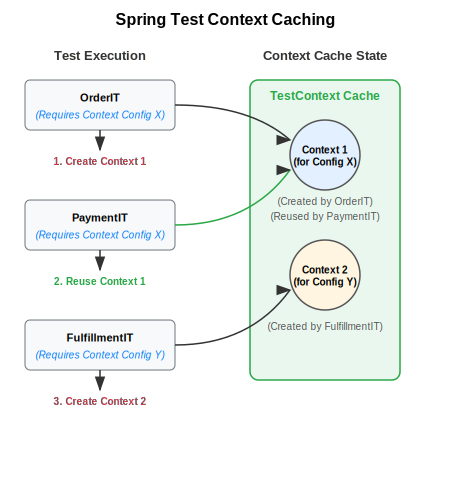
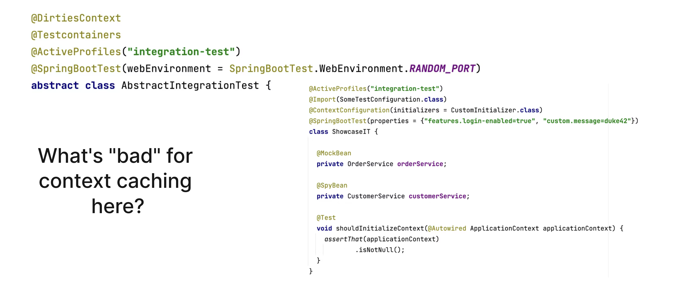

<!--

- Go to `DefaultContextCache` to show the cache

-->

## Spring Test `TestContext` Caching

- Part of Spring Test (automatically part of every Spring Boot project via `spring-boot-starter-test`)
- Spring Test caches an already started Spring `ApplicationContext` for later reuse
- Cache retrieval is usually faster than a cold context start
- Configurable cache size (default is 32) with LRU (least recently used) strategy

Speed up your build:

---

## Caching is King

---

## How the Cache Key is Built

This goes into the cache key (`MergedContextConfiguration`):

- activeProfiles (`@ActiveProfiles`)
- contextInitializersClasses (`@ContextConfiguration`)
- propertySourceLocations (`@TestPropertySource`)
- propertySourceProperties (`@TestPropertySource`)
- contextCustomizer (`@MockitoBean`, `@MockBean`, `@DynamicPropertySource`, ...)

---
## Identify Context Restarts

---

## Investigate the Logs

---

## Spot the Issues for Context Caching

---

## Context Caching Issues

Common problems that break caching:

1. Different context configurations
2. `@DirtiesContext` usage
3. Modifying beans in tests
4. Different property settings
5. Different active profiles

---

## Make the Most of the Caching Feature

- Avoid `@DirtiesContext` when possible, especially at `AbstractIntegrationTest` classes
- Understand how the cache key is built
- Monitor and investigate the context restarts
- Align the number of unique context configurations for your test suite

---

