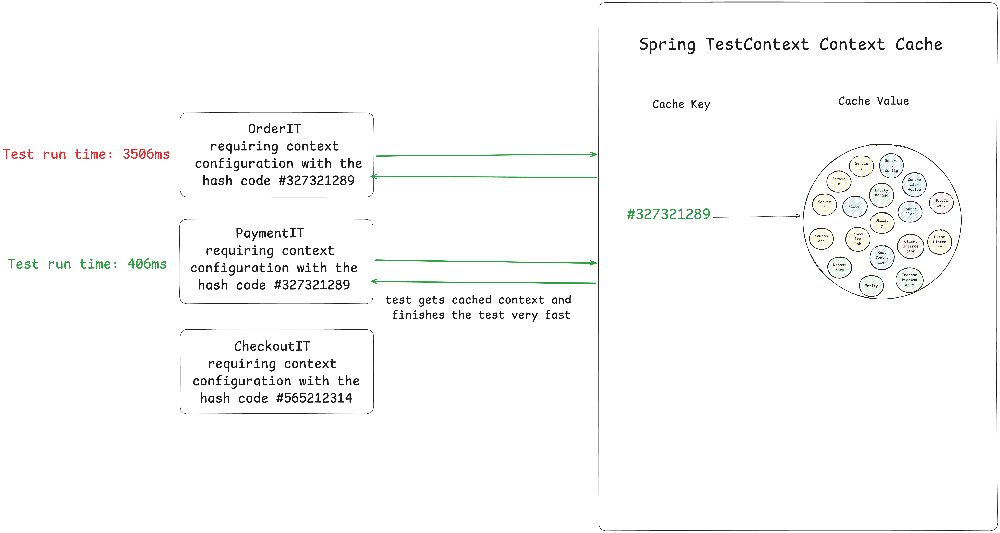
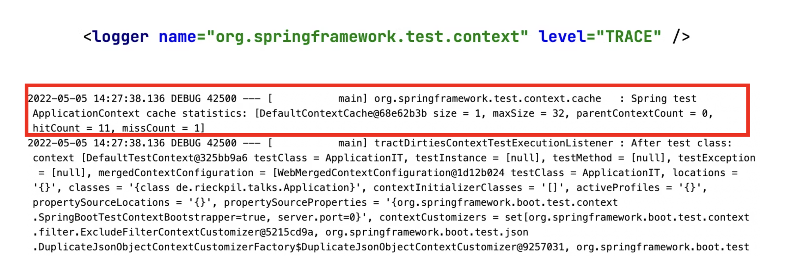

---

<!-- _class: title -->


# Testing Spring Boot Applications Demystified

## Lab 6

_Digdir Workshop 03.03.2026_

Philip Riecks - [PragmaTech GmbH](https://pragmatech.digital/) - [@rieckpil](https://x.com/rieckpil)

---

<!-- header: 'Testing Spring Boot Applications Demystified Workshop @ Digdir 03.03.2026' -->
<!-- footer: '' -->

## Discuss Exercises from Lab 5

- Discuss exercises
  - `Solution1MockMvcIntegrationTest`
  - `Solution2WebTestClientIntegrationTest`

---


# Lab 6

## Understanding Spring TestContext Context Caching

### Making Your Integration Test Suite Fast

---

## The Application Has Grown

The team kept shipping features - and writing integration tests:

- `@SpringBootTest` for each feature flow
- Different WireMock configurations per test class
- `@MockitoBean` for "quick isolation" wins
- A `@DirtiesContext` here and there to fix flaky tests

Then someone checks the CI build time…

---

## Build Time: The Hidden Tax


---

## The Root Cause

Every `@SpringBootTest` context startup costs **multiple seconds**:

- Testcontainers (PostgreSQL) starts → JDBC connection pool opens
- WireMock starts and stubs are registered
- Flyway runs migration scripts
- Spring wires all beans

If 10 test classes each create a **unique** context → **10 cold starts**

---

## The Solution: Spring Test Context Caching

- Built into Spring Test - available automatically via `spring-boot-starter-test`
- Caches a started `ApplicationContext` by a **cache key**
- Cache is per-JVM process (not shared across forks or CI agents)

Example of speed improvement:


---


---



---


---

### How the Cache is Built

```java
// DefaultContextCache.java
private final Map<MergedContextConfiguration, ApplicationContext> contextMap =
  Collections.synchronizedMap(new LruCache(32, 0.75f));
```

The following information is part of the Cache Key (`MergedContextConfiguration`):

- activeProfiles (`@ActiveProfiles`)
- contextInitializersClasses (`@ContextConfiguration`)
- propertySourceLocations (`@TestPropertySource`)
- propertySourceProperties (`@TestPropertySource`)
- contextCustomizer (`@MockitoBean`, `@MockBean`, `@DynamicPropertySource`, ...)
- etc.

---

### Spring's X-Ray: Building the `MergedContextConfiguration`

Before starting any context, Spring performs an **X-ray scan** of the test class:

1. Walks the class hierarchy and collects every context customisation point:
   - annotations (`@SpringBootTest`, `@ActiveProfiles`, `@TestPropertySource`)
   - `@ContextConfiguration` initializers
   - `@MockitoBean` / `@MockBean` definitions
   - `@DynamicPropertySource` methods
   - ...
2. Merges all collected metadata into a single **`MergedContextConfiguration`** object
3. Computes the **`hashCode`** of that object → this is the cache key

---

```text
Test class
    │
    ▼ 
MergedContextConfiguration {
  testClass, locations, classes,
  activeProfiles, propertyValues,
  contextInitializers, contextCustomizers   ← every @MockitoBean lands here
}
    │
    ▼  hashCode() / equals()
Cache hit? → reuse context   ✅
Cache miss? → start new context and store it   🆕
```

**Consequence:** even a single extra `@MockitoBean` changes the hash → **new context**.

---

### The Final Boss

`@DirtiesContext` is the most common context cache killer:

> Test annotation which indicates that the ApplicationContext associated with a test is dirty and should therefore be closed and removed from the context cache.
> 
> Use this annotation if a test has modified the context — for example, by modifying the state of a singleton bean, modifying the state of an embedded database, etc. 
> 
> Subsequent tests that request the same context will be supplied a new context.

---

## Use `@DirtiesContext` with Caution

Developers tend to consult AI/StackOverflow for integration test issues and often copy advice from the internet without knowing the implications:

```java
@SpringBootTest
@DirtiesContext
// this instructs Spring to remove the context from the cache
// and rebuild a new context on every request
public abstract class AbstractIntegrationTest {

}
```

The setup above will **disable** the context caching feature and slow down the builds significantly!

---

## Other Context Cache Killers

| Pattern | Reason |
|---|---|
| `@DirtiesContext` | Destroys the context — forces cold start |
| `@MockitoBean` | Replaces a bean → different cache key |
| `@ActiveProfiles("test")` | Adds a profile → different key |
| `@TestPropertySource(properties = "x=1")` | Extra property → different key |
| `@SpringBootTest(properties = "x=1")` | Extra property → different key |

These are fine **in isolation** - the problem is **using different ones** across test classes.

---

###  Detect Context Restarts - Visually


---

### Detect Context Restarts - with Logs



---

### Detect Context Restarts - with Tooling


An [open-source Spring Test utility](https://github.com/PragmaTech-GmbH/spring-test-profiler) that provides visualization and insights for Spring Test execution, with a focus on Spring context caching statistics.

**Overall goal**: Identify optimization opportunities in your Spring Test suite to speed up your builds and ship to production faster and with more confidence.

---

## Experiment: 5 Context Cache Killers

The `experiment` package contains five `ContextCacheKiller*IT` tests:

**Killer #1 - `@DirtiesContext`**
```java
@DirtiesContext(classMode = ClassMode.BEFORE_EACH_TEST_METHOD)
```
Destroys and recreates the context **before every single test method**.

**Killer #2 - `@MockitoBean`**
```java
@MockitoBean
OpenLibraryApiClient openLibraryApiClient;
```
Bean definition changes → Spring must create a **new context** with the mock.

---

## Experiment: More Context Cache Killers

**Killer #3 - `@ActiveProfiles` + `@MockitoBean` + `@TestPropertySource`**
```java
@ActiveProfiles("test")
@TestPropertySource(properties = "book.metadata.api.timeout=5")
@MockitoBean BookService bookService;
```
Three cache-key changes in one class → guaranteed unique context.

**Killer #4 - Different `@ActiveProfiles` + different `@MockitoBean`**
Same profile as Killer #3 but a different mock target → **still a different key**.

**Killer #5 - `@TestPropertySource` alone**
```java
@TestPropertySource(properties = "book.metadata.api.timeout=10")
```
A single extra property is enough to break caching.

---

## The Solution: Unify Context Configuration

- Create reusable base class with a single `@SpringBootTest` configuration
- Implement custom `ContextCustomizer`
- Implement reusable JUnit Jupiter extensions
- Try to have the least amount of differences in the context configuration across test classes
- Measure and adjust: don't blindly optimize for one context
- Share context caching insights with the team

---

## Rules for Subclasses

To keep the single cached context:

1. **No `@DirtiesContext`** - use `@Transactional` or `@Sql` for data isolation
2. **Sparringly use `@MockitoBean` / `@SpyBean`** - use WireMock stubs instead of mocking HTTP clients
3. **No extra `@TestPropertySource`** - all property overrides go into `application.yml`
4. **No different `@ActiveProfiles`** - pick one profile for all integration tests
5. **No extra `@SpringBootTest(properties = ...)` per class**

> If you genuinely need a different context (e.g. disabled security, different DB),
> create a **second base class** rather than ad-hoc annotations.

---

## Costs of Having Multiple Context Up- and Running

- All context remain active in-memory → memory usage, active thread pools, connections to databases, etc.
- All message listeners remain active → risk of test pollution via shared message queues
- Scheduled tasks remain active → risk of test pollution via shared state or external systems
- Interference between active contexts: e.g. carefully configure a message queue per context to avoid "stealing" messages between tests

---

## New in Spring Framework 7: Pausing Contexts

See Release Notes von [Spring Framework 7.0.0](https://spring.io/blog/2025/07/17/spring-framework-7-0-0-M7-available-now).

> The Spring TestContext framework is caching application context instances within test suites for faster runs. As of Spring Framework 7.0, we now pause test application contexts when they're not used.
>
> This means an application context stored in the context cache will be stopped when it is no longer actively in use and automatically restarted the next time the context is retrieved from the cache.
>
> Specifically, the latter will restart all auto-startup beans in the application context, effectively restoring the lifecycle state.

---


## Why Sliced Testing Still Matters

> *"If I have a `@SpringBootTest` that covers everything, why bother with `@WebMvcTest`?"*

- `@WebMvcTest`: 50 tests → starts in seconds, pinpoints web layer bugs
- `@DataJpaTest`: catches query and schema issues early
- `@SpringBootTest`: validates **wiring** - keep to key flows, not edge cases

**Anti-pattern:** replacing sliced tests with `@SpringBootTest` + `@MockitoBean`
→ slower suite AND breaks context caching

---

## Why Sliced Testing Still Matters


- **Speed**: Sliced contexts start in < 1 s vs 10–30 s for a full context
- **Corner cases**: reproducing a specific validation error or HTTP status via `@SpringBootTest` often requires a `@MockitoBean` → **that creates a new context**
- **Focus**: sliced tests fail closer to the root cause - easier to debug
- **Feedback loop**: run 50 `@WebMvcTest` tests in the time one `@SpringBootTest` starts

**Rule of thumb:**
- Extensive sliced testing for the **web** and **persistence** layers
- `@SpringBootTest` for key **integration paths** - the happy path and critical flows
- Never `@MockitoBean` your way through a `@SpringBootTest` - use sliced testing instead

---

# Time For Some Exercises
## Lab 6

- Navigate to the `labs/lab-6` folder and complete the tasks in the `README`
- **Exercise 1**: Run the `ContextCacheKiller*IT` tests, count contexts in the logs, and explain what breaks caching in each class
- **Exercise 2**: Create (or inspect) `SharedIntegrationTestBase` and refactor the killer tests to extend it - verify that only **one context** starts
- Time boxed: until the end of the lunch break
