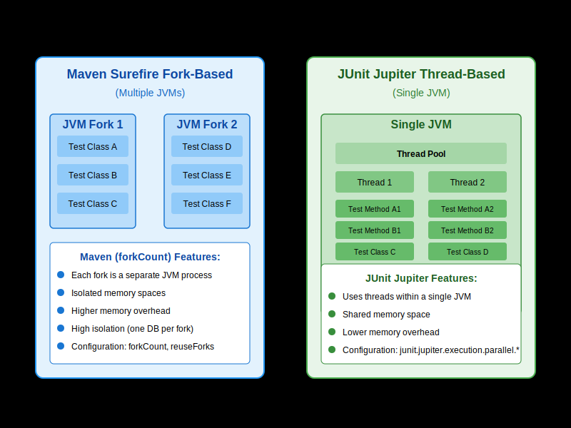
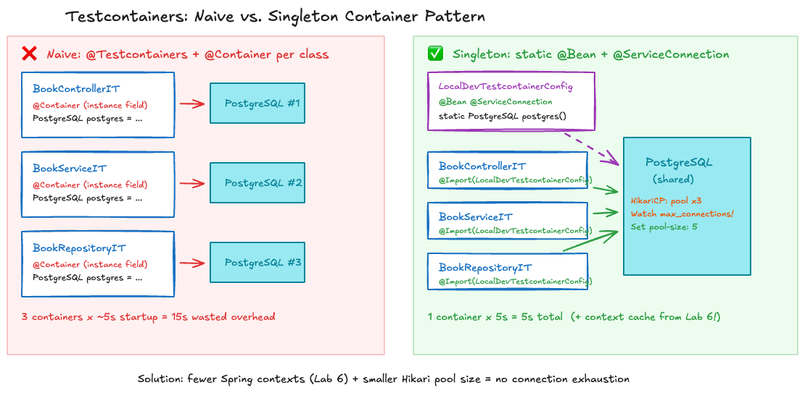

---

<!-- _class: title -->


# Testing Spring Boot Applications Demystified

## Lab 7

_Digdir Workshop 03.03.2026_

Philip Riecks - [PragmaTech GmbH](https://pragmatech.digital/) - [@rieckpil](https://x.com/rieckpil)

---

<!-- header: 'Testing Spring Boot Applications Demystified Workshop @ Digdir 03.03.2026' -->
<!-- footer: '' -->

## Discuss Exercises from Lab 6

- Exercises:
  - Solution1ContextCachingAnalysis
  - Solution2SharedBaseClassTest

---


# Lab 7

## Strategies for Fast and Reproducible Spring Boot Test Suites

### Build Speed & CI Excellence

---

## Test Parallelization

**Goal**: Reduce build time by running tests concurrently

Two independent mechanisms — they work at different levels:

| Mechanism | Level | Isolation |
|---|---|---|
| Maven Surefire/Failsafe `forkCount` | JVM processes | Separate heaps, class loaders |
| JUnit Jupiter parallel execution | Threads within one JVM | Shared heap, shared class loader |

These are **complementary** - you can (and should) use both together.

---

## Approach 1: Maven `forkCount` - Process Level

Splits tests across multiple **separate JVM processes**:

```xml
<plugin>
  <artifactId>maven-surefire-plugin</artifactId>
  <configuration>
    <forkCount>1C</forkCount>     <!-- 1 JVM per CPU core -->
    <reuseForks>true</reuseForks> <!-- Reuse JVMs across test classes -->
  </configuration>
</plugin>
```

- `forkCount=1` — default: one JVM for all tests
- `forkCount=2` — two JVMs running in parallel
- `forkCount=1C` — one JVM per available CPU core (dynamic)

> **Maven Failsafe** works the same way for `*IT.java` integration tests.

---

## Approach 2: JUnit Jupiter Parallel - Thread Level

Runs test **classes** (and/or methods) concurrently on threads within one JVM:

```properties
# src/test/resources/junit-platform.properties
junit.jupiter.execution.parallel.enabled = true
junit.jupiter.execution.parallel.mode.default = same_thread
junit.jupiter.execution.parallel.mode.classes.default = concurrent
```

Or configure directly in Maven Surefire:

```xml
<properties>
  <configurationParameters>
    junit.jupiter.execution.parallel.enabled = true
    junit.jupiter.execution.parallel.mode.default = same_thread
    junit.jupiter.execution.parallel.mode.classes.default = concurrent
  </configurationParameters>
</properties>
```

---



---

## JUnit Jupiter Parallelization Strategies Compared

| Strategy | `mode.classes.default` | `mode.default` | Effect |
|---|---|---|---|
| **Safest**  | `concurrent` | `same_thread` | Classes in parallel, methods sequential |
| **Fastest**  | `concurrent` | `concurrent` | Everything in parallel |
| **Sequential**  | `same_thread` | `same_thread` | Fully sequential |

Override per class with `@Execution`:

```java
@Execution(ExecutionMode.CONCURRENT)  // Override global setting for this class
class DiscountServiceTest { ... }
```

---

## Unit Tests: Writing Parallel-Safe Code

Unit tests are the easiest to parallelize - **no shared infrastructure**.

**What to AVOID:**

```java
class OrderServiceTest {
  // ❌ Static mutable state — shared across all threads!
  static int callCount = 0;

  // ❌ ThreadLocal without cleanup — leaks across tests in the same thread
  static ThreadLocal<String> currentUser = new ThreadLocal<>();

  @Test
  void shouldTrackCalls() {
    callCount++;  // ❌ Race condition when methods run concurrently
  }
}
```

---

## Unit Tests: The Safe Pattern

```java
@Execution(ExecutionMode.CONCURRENT)
class DiscountServiceTest {

  // ✅ Instance field — each test class instance gets its own
  private DiscountService cut;

  @BeforeEach
  void setUp() {
    cut = new DiscountService();  // ✅ Fresh instance, no shared state
  }

  @Test
  void shouldReturnTenPercentDiscount() {
    Book book = new Book("978-0-00-000001-1", "Test", "Author",
        LocalDate.now().minusMonths(7));
    book.setStatus(BookStatus.AVAILABLE);

    assertThat(cut.calculateDiscount(book)).isEqualTo(10);
  }
}
```

**Rules for parallel-safe unit tests:**
- No static mutable fields
- No shared service instances across tests
- No `ThreadLocal` usage without guaranteed cleanup

---

## Integration Tests: Different Challenges

Integration tests share infrastructure: database, WireMock, caches.

**The additional risks with parallel integration tests:**

- Two tests `INSERT` the same ISBN → unique constraint violation
- One test `DELETE`s a record another test expects to find
- `count()` assertions return unexpected results from other tests' inserts
- Testcontainers port conflicts when each class starts its own container

**The approach:** parallelize at the **class** level only (`mode.default = same_thread`), and enforce strong data isolation within each class.

---

## Integration Tests: What to AVOID

```java
@SpringBootTest
class BookIT {
  @Autowired BookRepository bookRepository;

  // ❌ Hardcoded ISBN — another parallel test class may insert the same one
  @Test
  void shouldSaveBook() {
    bookRepository.save(new Book("978-0-13-468599-1", "Clean Code",
        "Martin", LocalDate.now()));

    // ❌ Assumes the DB is empty — other parallel tests will break this
    assertThat(bookRepository.count()).isEqualTo(1);
  }

  // ❌ DirtiesContext forces a context restart — expensive AND breaks parallelism
  @DirtiesContext
  @Test
  void shouldHandleEdgeCase() { ... }
}
```

---

## Integration Tests: The Safe Pattern

```java
@SpringBootTest
@Transactional                    // ✅ Auto-rollback after each test
class BookIT {
  @Autowired BookRepository bookRepository;

  @Test
  void shouldSaveBook() {
    // ✅ Unique ISBN per test — no collision with parallel tests
    String isbn = UUID.randomUUID().toString().substring(0, 13);
    bookRepository.save(new Book(isbn, "Test Book", "Author", LocalDate.now()));

    // ✅ Find by this specific ISBN, not total count
    assertThat(bookRepository.findByIsbn(isbn)).isPresent();
  }
}
```

---

**Rules for parallel-safe integration tests:**
- `@Transactional` for automatic rollback after each test
- UUID-based test data - avoid hardcoding IDs or sharing them
- Never assert `count()` without scope limiting to your own data
- Use `@AfterEach deleteAll()` if `@Transactional` is not applicable (e.g. `WebTestClient`)
- No `@DirtiesContext` - use `@Sql` for data setup/teardown instead

---

## Parallelization: Unit vs. Integration Summary

| | Unit Tests | Integration Tests |
|---|---|---|
| Recommended tool | JUnit parallel + Surefire forks | JUnit class-level parallel |
| Safe `mode.default` | `concurrent` | `same_thread` |
| Safe `mode.classes` | `concurrent` | `concurrent` |
| Key isolation | No shared mutable state | `@Transactional` + unique data |
| `forkCount` | Very beneficial | Be careful with Testcontainers |
| Typical speed gain | 2–4× | 1.5–2× |

**Always measure! Run with and without, compare time.**

---

## Optimize Containers Time

### Correct Usage of Testcontainers

---

## The Naive Approach (and Why It's Slow)

```java
// ❌ Instance @Container — starts AND stops with every test class
@Testcontainers
@SpringBootTest
class BookControllerIT {

  @Container
  PostgreSQLContainer<?> postgres = new PostgreSQLContainer<>("postgres:16-alpine");
  //                    ↑ No static — new container per test class instance!
}
```

With 10 integration test classes → **10 container starts × ~5s each = 50s overhead**

Even with `@Container static` but spread across many classes, Ryuk stops the container between classes unless you share it properly.

---

## The Singleton Pattern: Static @Bean

Spring Boot 3.1+ -   use a `@TestConfiguration` with a `static` factory method:

```java
@TestConfiguration(proxyBeanMethods = false)
public class LocalDevTestcontainerConfig {

  // ✅ static method — container created once, shared across all contexts
  // ✅ @ServiceConnection — no @DynamicPropertySource boilerplate needed
  @Bean
  @ServiceConnection
  static PostgreSQLContainer<?> postgres() {
    return new PostgreSQLContainer<>("postgres:16-alpine")
      .withDatabaseName("testdb")
      .withUsername("test")
      .withPassword("test");
  }
}
```

Use it in every integration test: `@Import(LocalDevTestcontainerConfig.class)`

---

## Singleton Container Visualized



---


## The Hidden Danger: Connection Pool Exhaustion

Each Spring context has its **own HikariCP connection pool**.

```text
PostgreSQL max_connections = 100  (default)

Context A  →  HikariPool (10 connections each)  ─┐
Context B  →  HikariPool (10 connections each)   ├──▶ 1 Postgres container
Context C  →  HikariPool (10 connections each)   │    (30 connections used)
Context D  →  HikariPool (10 connections each)  ─┘

10th context starts → FATAL: sorry, too many clients already
```

This is why Lab 6 context caching and Lab 7 parallelization work **together** - fewer contexts means fewer connection pools.

---

## Preventing Connection Pool Exhaustion

**Option 1 - Maximize context reuse** (from Lab 6):

→ One `SharedIntegrationTestBase` → one context → one pool

**Option 2 - Reduce pool size per context:**

```yaml
spring:
  datasource:
    hikari:
      maximum-pool-size: 5   # ↓ down from default 10
```

**Option 3 - Raise PostgreSQL's max_connections:**

```java
new PostgreSQLContainer<>("postgres:16-alpine")
  .withCommand("postgres", "-c", "max_connections=200");
```

---

## Testcontainers Reuse Mode

Skip container startup entirely between local test runs:

```java
static PostgreSQLContainer<?> postgres = new PostgreSQLContainer<>("postgres:16-alpine")
  .withReuse(true);  // ← Surviving container is reused on next run
```

Requires `~/.testcontainers.properties`:

```properties
testcontainers.reuse.enable=true
```

**Implications:**
- Container keeps its state between runs → good test isolation (`@Transactional`) is critical

---

## Further Testcontainers Optimization Tips

- (CI-relevant) Pre-pull images to avoid rate limits and cold starts, make sure the pulled image is cached in the CI environment
- Use custom Docker images to e.g., pre-create the database schema, reducing startup time
- Start multiple Docker containers in parallel `Startables.deepStart(postgres, kafka).join();`
- Consider [Zonky](https://github.com/zonkyio/embedded-database-spring-test) Embedded Database

---

# Maven Best Practices for Testing

---

## Tip 1: Hide Test Output, Show on Failure

By default, all test output floods the console. 

Redirect it to files:

```xml
<plugin>
  <artifactId>maven-surefire-plugin</artifactId>
  <configuration>
    <!-- Output goes to surefire-reports/*.txt -->
    <redirectTestOutputToFile>true</redirectTestOutputToFile>
    <trimStackTrace>false</trimStackTrace>
  </configuration>
</plugin>
```

---

## Tip 2: Rerun Flaky Tests Automatically

Instead of failing the build on a first flaky failure, retry automatically:

```xml
<plugin>
  <artifactId>maven-surefire-plugin</artifactId>
  <configuration>
    <!-- Retry failing tests up to 2 times before reporting as failure -->
    <rerunFailingTestsCount>2</rerunFailingTestsCount>
  </configuration>
</plugin>
```

- A test that passes on retry is reported as **"flaky"** in the XML report, not as a failure

```text
Tests run: 2, Failures: 0, Errors: 0, Skipped: 0, Flakes: 1
```

- This is a **safety net**, not a fix - investigate and eliminate the root cause

---

## Tip 3: Maven Daemon Locally

`mvnd` keeps a hot Maven JVM between builds - no JVM startup cost:

```bash
# Install (macOS)
brew install mvnd

# Identical commands — just replace ./mvnw with mvnd
mvnd test
mvnd verify
mvnd clean install -DskipTests
```

Works seamlessly with all plugins. Particularly helpful for rapid TDD cycles.

---

## Tip 4: Skip Integration Tests for Fast Local Iteration

Add a `skipITs` property to Failsafe so developers can opt out of slow tests:

```xml
<plugin>
  <artifactId>maven-failsafe-plugin</artifactId>
  <configuration>
    <skipITs>${skipITs}</skipITs>
  </configuration>
</plugin>
```

```bash
# Fast local unit tests only
./mvnw verify -DskipITs

# Full build including integration tests
./mvnw verify
```

---

## Tip 5: Fail Fast vs. Collect All Failures

```bash
# Default: stop on first failure (fast feedback on blocking issue)
./mvnw verify

# Collect ALL failures, then report at the end (see full picture in one run)
./mvnw verify --fail-at-end
```

Use `--fail-at-end` in CI to see all failures in a single build, saving a feedback loop.

Use the default in local development when you want to fix one issue at a time.

---

## Tip 6: Dedicated CI Build Profile

Separate CI-specific settings from the default developer experience:

```xml
<profiles>
  <profile>
    <id>ci</id>
    <build>
      <plugins>
        <plugin>
          <artifactId>maven-surefire-plugin</artifactId>
          <configuration>
            <forkCount>1C</forkCount>
            <redirectTestOutputToFile>true</redirectTestOutputToFile>
          </configuration>
        </plugin>
      </plugins>
    </build>
  </profile>
</profiles>
```

```bash
./mvnw verify -P ci
```

---

# GitHub Actions Best Practices

---

## Best Practice 1: Always Set a Job Timeout

Hanging Testcontainers or infinite loops block CI slots for hours without a timeout:

```yaml
jobs:
  build:
    runs-on: ubuntu-latest
    timeout-minutes: 20    # ← Kill the job if it exceeds this
```

Good defaults:
- Unit tests only: `timeout-minutes: 10`
- Integration tests: `timeout-minutes: 20`
- Full build with slow ITs: `timeout-minutes: 30`

**No timeout = expensive surprise when a container hangs pulling an image.**

---

## Best Practice 2: Cache Maven Dependencies

The `cache: maven` flag in `setup-java` automatically caches `~/.m2/repository`:

```yaml
- uses: actions/setup-java@v4
  with:
    java-version: '21'
    distribution: 'temurin'
    cache: maven              # ← Saves multiple MB download every run
```

Or with manual cache control (for advanced invalidation):

```yaml
- uses: actions/cache@v4
  with:
    path: ~/.m2/repository
    key: ${{ runner.os }}-maven-${{ hashFiles('**/pom.xml') }}
    restore-keys: |
      ${{ runner.os }}-maven-
```

**Impact:** Cuts CI time by 1–3 minutes on dependency-heavy projects.

---

## Best Practice 3: Enable Testcontainers Reuse in CI

Pre-pull images to avoid rate limiting when running tests in parallel:

```yaml
- name: Pre-pull Testcontainers images
  run: docker pull postgres:16-alpine

- name: Enable Testcontainers container reuse
  run: echo "testcontainers.reuse.enable=true" >> ~/.testcontainers.properties
```


**Note:** Container reuse in CI only helps when multiple test jobs share the same runner and Docker daemon. For ephemeral runners, pre-pulling the image is the main win.

---

## Best Practice 4: Try Separating Unit and Integration Test Jobs

Measure if splitting is an option, otherwise run them together with `./mvnw verify`:

```yaml
jobs:
  unit-tests:
    runs-on: ubuntu-latest
    timeout-minutes: 10
    steps:
      - uses: actions/checkout@v4
      - uses: actions/setup-java@v4
      - run: ./mvnw test

  integration-tests:
    runs-on: ubuntu-latest
    timeout-minutes: 20
    steps:
      - uses: actions/checkout@v4
      - uses: actions/setup-java@v4
      - run: ./mvnw verify -DskipUnitTests
```

---

## Best Practice 5: Publish Test Results

Make test failures visible directly in the PR UI:

```yaml
- name: Upload test reports
  uses: actions/upload-artifact@v4
  if: always()           # ← Upload even when tests fail
  with:
    name: test-reports
    path: |
      **/target/surefire-reports/
      **/target/failsafe-reports/
```

---

Or use `dorny/test-reporter` for inline PR annotations:

```yaml
- uses: dorny/test-reporter@v1
  if: always()
  with:
    name: Maven Tests
    path: '**/surefire-reports/TEST-*.xml,**/failsafe-reports/TEST-*.xml'
    reporter: java-junit
```

---

## Best Practice 6: Cancel Stale Runs

Avoid wasting CI minutes running old commits when a new push arrives:

```yaml
concurrency:
  group: ${{ github.workflow }}-${{ github.ref }}
  cancel-in-progress: true    # ← Cancel the previous run for this branch
```

**Combined workflow example** (`labs/lab-7/.github/workflows/build.yml`):

```yaml
on:
  push:
    branches: [ main ]
  pull_request:
    branches: [ main ]
concurrency:
  group: ${{ github.workflow }}-${{ github.ref }}
  cancel-in-progress: true
```

---

## Best Practice 7: Launch the App in Docker and Smoke-Test It

Catch **deployment-time failures** that automated unit/integration tests miss.

Create a new workflow before e.g. deployment:

- Custom JVM startup flags or `-javaagent` entries missing in the image
- Missing fonts or native libraries in the container OS (e.g. `libfreetype` for PDF rendering)
- Incorrect `ENTRYPOINT` or `CMD` in the `Dockerfile`
- Memory limits or GC settings that cause OOM at startup

---

```yaml
- name: Build Docker image
  run: ./mvnw spring-boot:build-image -DskipTests
  # Builds a production OCI image using Cloud Native Buildpacks

- name: Smoke-test the Docker image
  run: |
    docker run --rm -d --name app-smoke \
      -e SPRING_DATASOURCE_URL=jdbc:postgresql://localhost:5432/testdb \
      -p 8080:8080 lab-7:1.0.0
    sleep 10
    curl --fail http://localhost:8080/actuator/health
    docker stop app-smoke
```

---

## Best Practice 7: Smoke-Test with Testcontainers in CI

Or use a dedicated `@SpringBootTest` that starts the **real Docker image**:

```java
// Launches your production Docker image — not the fat JAR — in CI
@SpringBootTest(webEnvironment = SpringBootTest.WebEnvironment.NONE)
@Testcontainers
class DockerImageSmokeIT {

  @Container
  static GenericContainer<?> app = new GenericContainer<>(
      DockerImageName.parse("lab-7:1.0.0"))
    .withExposedPorts(8080)
    .waitingFor(Wait.forHttp("/actuator/health").forStatusCode(200));

  @Test
  void shouldStartAndRespondToHealthCheck() {
    String url = "http://localhost:" + app.getMappedPort(8080) + "/actuator/health";
    // Assert the real image starts in a real Docker container
    assertThat(app.isRunning()).isTrue();
  }
}
```
---

## Best Practice 8: Upload Screenshots of Failed UI Tests

```yaml
- name: Run UI / E2E tests
  run: ./mvnw verify -P e2e
  continue-on-error: true   # Don't stop — let the upload step run

- name: Upload screenshot artifacts on failure
  uses: actions/upload-artifact@v4
  if: failure()             # Only when something broke
  with:
    name: failed-ui-screenshots
    path: |
      **/target/screenshots/
      **/target/videos/
```

Works with **Selenide** (`screenshots/` folder), **Playwright** (`videos/`), or any framework that saves files on failure.

---

## Best Practice 9: Nightly E2E Runs Against Real Environments

E2E tests that hit a real HTTP endpoint should accept the base URL as a configurable parameter:

```java
// Base URL driven by a system property — falls back to localhost for local runs
@SpringBootTest(webEnvironment = RANDOM_PORT)
class BookApiE2ETest {

  @Value("${e2e.base-url:http://localhost:${local.server.port}}")
  private String baseUrl;

  private WebTestClient webTestClient;

  @BeforeEach
  void setUp() {
    webTestClient = WebTestClient.bindToServer()
      .baseUrl(baseUrl)
      .build();
  }
}
```

---

Schedule a nightly workflow that passes the target environment URL:

```yaml
on:
  schedule:
    - cron: '0 2 * * *'   # 02:00 UTC every night

jobs:
  e2e:
    runs-on: ubuntu-latest
    steps:
      - uses: actions/checkout@v4
      - name: Run E2E tests against QA
        run: ./mvnw verify -P e2e -De2e.base-url=${{ vars.QA_BASE_URL }}
```

The same tests run locally against `localhost` and in CI against `DEV` or `QA` - no code changes needed.

---

# Time For Some Exercises

## Lab 7

- Navigate to the `labs/lab-7` folder and complete the tasks in the `README`
- **Exercise 1**: Observe and measure the effect of different parallelization settings
- **Exercise 2**: Make all integration tests pass reliably under parallel execution
- Time boxed: until the end of the coffee break

